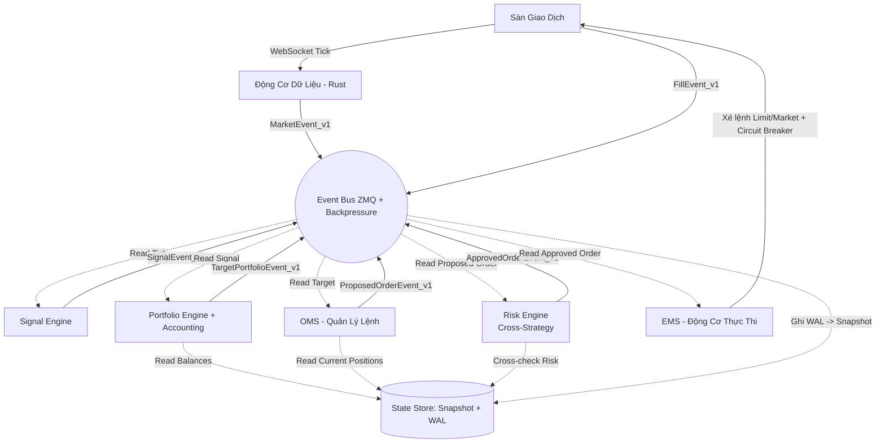

📂 KIẾN TRÚC HỆ THỐNG (DIRECTORY STRUCTURE)

```text
KAIROS_QUANT_ENTERPRISE/
├── .env                        # Chứa API Keys, Passwords (KHÔNG commit)
├── .gitignore
├── docker-compose.yml          # Đóng gói hạ tầng (Redis, ZMQ, Grafana)
├── Dockerfile
├── Makefile                    # Phím tắt thao tác (make train, make live)
├── pyproject.toml              # Quản lý thư viện Python (Poetry/Ruff)
├── README.md                   # Bạn đang đọc file này
├── kiem_tra_rest_api.py        # Test runner REST layer (--unit / --live)
│
# ==========================================
# ⚙️ 1. CẤU HÌNH & MÔI TRƯỜNG (CONFIG & RUNTIME)
# ==========================================
├── cau_hinh/
│   ├── adapter_loader.py       # Tự động nạp Adapter cấu hình
│   ├── giao_dich.yaml          # Thông số vốn, đòn bẩy
│   ├── rui_ro.yaml             # Giới hạn Drawdown, Max Position
│   ├── san_giao_dich.yaml      # Cấu hình API, rate limit các sàn
│   └── chien_luoc.yaml         # Trọng số phân bổ cho các Alpha
│
├── moi_truong_chay/            # (RUNTIME ISOLATION) Tách biệt tuyệt đối
│   ├── live/                   # Chạy tiền thật (Event bus & DB riêng biệt)
│   ├── paper/                  # Chạy tiền ảo (Testnet)
│   │   ├── microstructure_model.py # Mô phỏng vi cấu trúc thị trường
│   │   ├── paper_ems_adapter.py    # Adapter thực thi cho Paper Trading
│   │   ├── paper_runner.py         # Script chạy chính cho môi trường Paper
│   │   ├── paper_state_manager.py  # Quản lý trạng thái lệnh ảo
│   │   └── shock_simulator.py      # Giả lập các cú sốc thị trường
│   └── backtest/               # Chạy giả lập quá khứ
│
# ==========================================
# 🗄️ 2. HỒ DỮ LIỆU (DATA LAKE - PARTITIONED)
# ==========================================
├── ho_du_lieu/
│   ├── tho/                    # (Raw) Dữ liệu gốc bất biến
│   │   ├── lich_su_khop_lenh/  # (Trades) Chuẩn: symbol=BTCUSDT/date=2024-01-01/part-000.parquet
│   │   ├── so_lenh_l2/         # (Orderbook L2) Phân mảnh theo ngày/cặp coin
│   │   └── funding_liquid/     # (Funding rates & Thanh lý)
│   │
│   ├── da_xu_ly/               # Dữ liệu đã làm sạch & đồng bộ
│   ├── kho_dac_trung/          # (Feature Store)
│   │   ├── offline/            # Phục vụ train AI
│   │   └── online/             # Cache trên RAM phục vụ chạy Live
│   │       └── memory_store.py # OnlineFeatureStore
│   └── danh_muc/               # (Catalog) Lưu metadata của Data
│
# ==========================================
# ⚡ 3. ĐỘNG CƠ DỮ LIỆU (DATA ENGINE)
# ==========================================
├── dong_co_du_lieu/
│   ├── thu_thap/               # (Collector)
│   │   ├── websocket/          # Real-time streaming — push từ sàn
│   │   │   ├── binance_ws.py   # BinanceGateway
│   │   │   ├── okx_ws.py       # OkxGateway
│   │   │   └── bybit_ws.py     # BybitGateway
│   │   └── rest_api/           # Polling định kỳ — pull từ sàn
│   │       ├── __init__.py     # Re-export toàn bộ poller + RestDataEvent
│   │       ├── base_rest.py    # BaseRestPoller
│   │       ├── binance_rest.py # BinanceRestPoller: OI(5m)/FR(1h)/L/S(5m)/klines(1m)
│   │       ├── okx_rest.py     # OkxRestPoller: OI/FR/L/S/klines — BTC-USDT-SWAP
│   │       ├── bybit_rest.py   # BybitRestPoller: OI/FR/L/S/klines — retCode=0
│   │       └── onchain_rest.py # CryptoQuantPoller: BTC/ETH reserve+netflow,
│   │
│   ├── xu_ly_dong/             # (Stream Processor) Xử lý data realtime
│   │   └── bo_loc/
│   │       ├── orderbook_engine.py  # BaseOrderBookEngine + Binance/OKX/Bybit engine L2 sync
│   │       └── ohlc_engine.py       # OHLCVAggregator + OHLCVEngine (Corrected name)
│   │
│   ├── xu_ly_lo/               # (Batch Processor) Xử lý data lịch sử
│   └── ong_dan_dac_trung/      # (Alpha Factory) Ultra-HFT feature pipeline <10µs/tick
│       └── online/
│           ├── feature_registry.py    # FEATURE_REGISTRY
│           └── incremental_engine.py  # IncrementalFeatureEngine
│
# ==========================================
# 🧪 4. PHÒNG NGHIÊN CỨU & KIỂM THỬ (RESEARCH & REPLAY)
# ==========================================
├── nghien_cuu/
│   ├── so_tay_jupyter/         # (Notebooks) Nơi vọc vạch data
│   ├── nha_may_alpha/          # (Alpha Factory) Kho chứa các ý tưởng giao dịch
│   ├── dong_co_phat_lai/       # (REPLAY ENGINE) Cực kỳ quan trọng
│   │
│   ├── kiem_thu_qua_khu/       # (Backtest Engine)
│   │   ├── ma_tran_sie_toc/    # (Vectorized) Dùng Polars
│   │   └── mo_phong_su_kien/   # (Event-driven) Tính toán trượt giá chuẩn xác
│   └── danh_gia/               # (Evaluation) Sharpe ratio, Maximum Drawdown...
│
# ==========================================
# 🤖 5. TRÍ TUỆ NHÂN TẠO & MLOps (MACHINE LEARNING)
# ==========================================
├── hoc_may/
│   ├── mo_hinh/                # (Models) PyTorch LSTMs, Transformers
│   ├── huan_luyen/             # Script train model
│   ├── suy_luan/               # Logic Inference tối ưu bằng ONNX/TensorRT
│   ├── to_hop_alpha/           # (Alpha Combiner) Hợp nhất các tín hiệu lại
│   └── giam_sat_mo_hinh/       # (ML MONITORING)
│       ├── sai_lech_dac_trung/ # (Feature Drift) Cảnh báo nếu bối cảnh market đổi
│       └── sai_lech_du_doan/   # (Prediction Drift) 
│
# ==========================================
# ⚔️ 6. THỰC THI CHIẾN DỊCH (EXECUTION CORE)
# ==========================================
├── thuc_thi_lenh/
│   ├── bo_nho_trang_thai/      # [SINGLE SOURCE OF TRUTH] Nguồn sự thật duy nhất
│   │   ├── snapshot/           # Dump state định kỳ mỗi 5s (Load nhanh)
│   │   ├── nhat_ky_wal/        # Write-Ahead Log (Bảo vệ tick cuối cùng)
│   │   │   └── durable_wal.py  # Ghi log bền vững để chống mất data
│   │   ├── vi_the/             # (Positions)
│   │   ├── so_lenh/            # (Orders)
│   │   ├── so_du/              # (Balances)
│   │   └── state_manager.py    # Quản lý trạng thái hệ thống
│   │
│   ├── cong_ket_noi/           # (Gateway) Wrapper chuẩn hóa Binance/Bybit/OKX
│   │   ├── base_adapter.py     # Lớp cơ sở cho các Adapter sàn
│   │   ├── binance_adapter.py  # Adapter cho Binance
│   │   ├── bybit_adapter.py    # Adapter cho Bybit
│   │   ├── okx_adapter.py      # Adapter cho OKX
│   │   └── chien_luoc_thu_lai/ # (RETRY POLICY) Rate Limit + Circuit Breaker
│   │
│   ├── dong_co_tin_hieu/            # (Signal Engine) Lắng nghe ML sinh tín hiệu
│   │   ├── models/                  # Mô hình ml
│   │   ├── ml_signal_engine.py      # Động cơ tín hiệu dựa trên Machine Learning
│   │   └── mock_onnx_generator.py   # Giả lập tín hiệu ONNX phục vụ kiểm thử
│   │
│   ├── quan_ly_danh_muc/            # (Portfolio Engine) Quyết định Size
│   │   └── ke_toan_pnl/             # (ACCOUNTING) Chuẩn kế toán quỹ
│   │       ├── realized_pnl/        # Chốt lời/lỗ thực
│   │       ├── unrealized_pnl/      # Lời/lỗ chưa chốt
│   │       └── phi_va_funding/      # Phí giao dịch & Funding Rate
│   │
│   ├── danh_ba_chien_luoc/          # (STRATEGY REGISTRY) Quản lý đa chiến lược
│   │   ├── chien_luoc_active/       # Các chiến lược đang chạy live
│   │   └── trong_so_phan_bo/        # Phân bổ vốn cho từng chiến lược
│   │
│   ├── quan_ly_lenh/                # (OMS) Kế toán ghi chép Lệnh Mẹ
│   ├── dong_co_thuc_thi/            # (EMS) Lính bắn tỉa xé lệnh (Smart Router, TWAP)
│   │   ├── ems.py                   # Động cơ thực thi lệnh chính
│   │   └── execution_risk_engine.py # Kiểm soát rủi ro trong quá trình thực thi
│   │
│   ├── theo_doi_do_tre/             # (LATENCY TRACKER) Bắt buộc phải đo
│   │   ├── tick_den_tin_hieu/       # Tick -> Signal: ? µs
│   │   ├── tin_hieu_den_lenh/       # Signal -> Order: ? µs
│   │   └── lenh_den_khop/           # Order -> Fill: ? ms
│   │
│   └── vong_lap_su_kien.py          # (Event Loop) Trái tim duy trì nhịp đập Live
│
# ==========================================
# 🚨 7. LƯỚI BẢO VỆ (RISK SYSTEM)
# ==========================================
├── quan_tri_rui_ro/
│   ├── rui_ro_cheo_chien_luoc/ # (CROSS-STRATEGY RISK)
│   │   ├── bu_tru_vi_the/      # (Exposure Netting) Tránh nội bộ đánh nhau (Long vs Short)
│   │   └── xung_dot_tin_hieu/  # (Conflict Detector)
│   │
│   ├── kiem_tra_truoc_lenh/        # (Pre-trade Risk) Chặn lệnh Fat-finger
│   │   ├── rules/                  # Tập hợp các bộ quy tắc rủi ro
│   │   │   ├── base_rule.py        # Giao diện cơ sở cho Rule rủi ro
│   │   │   ├── global_rules.py     # Quy tắc rủi ro toàn cục
│   │   │   ├── position_rules.py   # Quy tắc giới hạn vị thế
│   │   │   └── rate_rules.py       # Quy tắc giới hạn tần suất lệnh
│   │   ├── reconciliation.py       # Đối soát trạng thái
│   │   ├── risk_codes.py           # Mã lỗi quản trị rủi ro
│   │   └── risk_gate.py            # Cổng kiểm soát rủi ro chính
│   └── nguoi_gac_cong/             # (Watchdog) Tiến trình độc lập gỡ chốt tự hủy (Kill Switch)
│       └── watchdog/
│           ├── watchdog.py             # Logic giám sát và kích hoạt Kill Switch
│           └── adapters/
│               ├── lite_rest.py        # Kết nối REST nhẹ để kiểm tra trạng thái
│               └── war_grade_rest.py   # Kết nối REST cấp độ cao cho tình huống khẩn cấp
│
# ==========================================
# 🔗 8. HẠ TẦNG & GIAO TIẾP (INFRASTRUCTURE)
# ==========================================
├── ha_tang/
│   ├── bus_su_kien/             # (Event Bus) Pub/Sub bằng ZeroMQ
│   │   ├── zmq_bus.py           # AsyncEventBus: PUB/SUB multi-part, orjson, HWM backpressure
│   │   ├── luoc_do_du_lieu/     # (EVENT SCHEMA VERSIONING) v1/, v2/
│   │   │   └── v1/
│   │   │       ├── base_event.py       # BaseEvent: frozen, UUID event_id, timestamp_ns (ns)
│   │   │       ├── market_schema.py    # BaseEvent
│   │   │       ├── state_schema.py     # BalanceModel, PositionModel
│   │   │       ├── feature_schema.py   # FeatureEvent_v1
│   │   │       ├── execution_schema.py # Schema cho Execution Events
│   │   │       └── signal_schema.py    # Schema cho Signal Events
│   │   └── kiem_soat_luu_luong/        # (BACKPRESSURE CONTROL) Tránh quá tải RAM
│   │       ├── drop_policy/            # Bỏ qua Tick data cũ nếu nghẽn
│   │       └── priority_channel/       # Luôn ưu tiên Fill Event và Risk Alert
│   │
│   ├── bo_nho_chung/               # (Shared Memory)
│   └── dong_ho_thoi_gian/          # (Clock)
│       └── time_validator.py       # Xác thực đồng bộ thời gian hệ thống
│
# ==========================================
# 📊 9. GIÁM SÁT & KIỂM THỬ (MONITORING & TESTING)
# ==========================================
├── giam_sat/
│   ├── chi_so_hieu_suat/          # (Metrics) RAM, CPU
│   └── canh_bao_telegram/         # (Alerts)
├── kiem_thu/
│   └── san_gia_lap/               # (Mock Exchange) Khớp lệnh ảo
│
├── test/                          # (Unit & Integration Tests)
│   ├── test_chaos_risk.py         # Kiểm thử rủi ro hỗn loạn
│   ├── test_execution_pipeline.py
│   ├── test_feature_layer.py
│   ├── test_rest_api.py
│   ├── test_signal_engine.py
│   ├── test_profiler.py           # Đo hiệu năng hệ thống
│   ├── test_state.py              # Kiểm thử quản lý trạng thái
│   ├── test_ws_gateway_fixes.py   # Kiểm thử bản vá WebSocket
│   ├── xem_du_lieu_binance.py
│   ├── xem_du_lieu_bybit.py
│   ├── xem_du_lieu_okx.py
│   └── xem_du_lieu_tho.py
│
# ==========================================
# 🚀 10. KỊCH BẢN VẬN HÀNH (SCRIPTS)
# ==========================================
└── kich_ban/
```

🌊 LUỒNG DỮ LIỆU THỰC CHIẾN (EVENT-DRIVEN FLOW)

Tuyệt đối không có "State" nằm rải rác. Mọi thứ xoay quanh Single Source of Truth và Event Bus.


