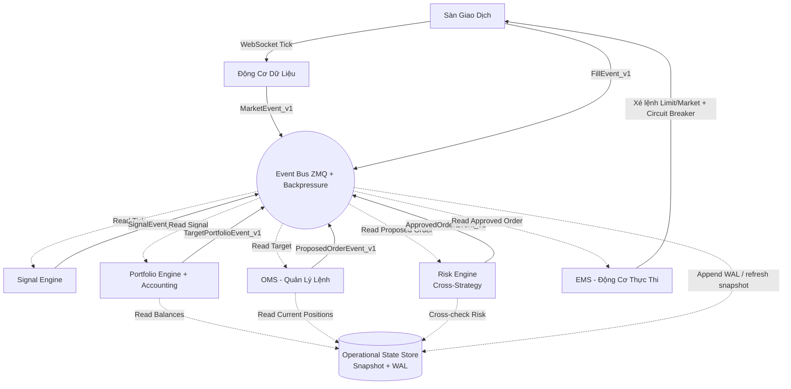

<div align="center">
 


# KAIROS v3.0
### **Hệ thống giao dịch định lượng (Quant Trading) tự động hóa toàn diện, với kiến trúc độ trễ cực thấp (Ultra-Low Latency) lấy cảm hứng từ các tiêu chuẩn HFT (HFT-Inspired)**

[](https://www.python.org/)
[](https://www.binance.com/)
[](https://opensource.org/licenses/MIT)

`Python` • `ETL Pipeline` • `Backtesting` • `Quant Analysis`

| Trường | Giá trị |
|--------|---------|
| Phiên bản tài liệu | v3.0 |
| Ngày cập nhật | 2026-05-06 |
| Trạng thái | In Development — không dùng làm production reference khi chưa pass Production Checklist (§8) |
| Phạm vi | Architecture specification & implementation reference cho KAIROS v3 |
| Test coverage | 43 unit/integration tests — `test/` directory |

<div align="left">
 
---

## 📑 Mục Lục

- [0. ⚠️ Đọc Trước Khi Tham Khảo](#read-this-first)
- [1. 🌊 Luồng Dữ Liệu Thực Chiến (Data Flow)](#1--luồng-dữ-liệu-thực-chiến-data-flow)
- [2. 📂 Kiến Trúc Hệ Thống (Directory Map)](#2--kiến-trúc-hệ-thống-directory-map)
- [3. 🧩 Đặc Tả Module (Module Specifications)](#3--đặc-tả-module-module-specifications)
  - [3.1. Cấu Hình & Môi Trường](#31--cấu-hình--môi-trường-config--runtime)
  - [3.2. Hồ Dữ Liệu](#32-️-hồ-dữ-liệu-data-lake)
  - [3.3. Động Cơ Dữ Liệu](#33--động-cơ-dữ-liệu-data-engine)
  - [3.4. Phòng Nghiên Cứu](#34--phòng-nghiên-cứu--kiểm-thử-research--replay-wip)
  - [3.5. Trí Tuệ Nhân Tạo](#35--trí-tuệ-nhân-tạo--mlops-machine-learning-wip)
  - [3.6. Thực Thi Chiến Dịch](#36-️-thực-thi-chiến-dịch-execution-core)
  - [3.7. Lưới Bảo Vệ](#37--lưới-bảo-vệ-risk-system)
  - [3.8. Hạ Tầng & Giao Tiếp](#38--hạ-tầng--giao-tiếp-infrastructure)
  - [3.9. Giám Sát & Kiểm Thử](#39--giám-sát--kiểm-thử-monitoring--testing)
- [4. 💎 Ràng Buộc & Quyết Định Thiết Kế (Design Constraints)](#4--ràng-buộc--quyết-định-thiết-kế-design-constraints--engineering-decisions)
- [8. ✅ Kiểm Tra Sẵn Sàng Production (Production Readiness Checklist)](#8--kiểm-tra-sẵn-sàng-production-production-readiness-checklist)

---

<a id="read-this-first"></a>
## 0. ⚠️ Đọc Trước Khi Tham Khảo

Kairos là một engine `HFT-inspired` tối ưu rất mạnh cho độ trễ thấp. README này không nên được hiểu là xác nhận hệ thống đã đạt `formal correctness` cho real-money trading trong mọi failure mode. Ở nhiều điểm, thiết kế hiện tại ưu tiên `latency-first`, nên người tham khảo cần đọc rõ các giả định và ranh giới an toàn trước khi tái sử dụng.

**Cần hiểu đúng các khái niệm sau:**

- `Snapshot + WAL` hiện nên được hiểu là **persistence backbone / operational truth source** cho state trọng yếu. Chỉ nên gọi là `Single Source of Truth` tuyệt đối khi mọi mutation đều bắt buộc đi qua WAL và replay luôn rebuild ra cùng logical state.
- `Drop`, `coalescing`, `backpressure shedding`, và `fail-fast` là quyết định hiệu năng; chúng không mặc định an toàn cho real trading nếu event bị bỏ có thể làm sai quyết định hoặc làm lệch state. Khi đó phải có `gap detection`, `degraded mode`, hoặc `halt`.
- `Deterministic replay` chỉ có nghĩa khi input stream, ordering, seed, timestamp semantics, và side effects external đều được kiểm soát. Paper determinism không đồng nghĩa live determinism.
- `SPSC ring buffer`, `OCC retries`, và mô hình `thread + asyncio` đều dựa trên assumption chặt. Nếu assumption không được runtime-enforce hoặc stress-test, correctness có thể sai dù latency vẫn đẹp.
- `Integer-scaled arithmetic` chỉ giải quyết sai số `float`; nó không tự động giải quyết `currency normalization`, `funding sign conventions`, `fee model`, hay sự khác biệt giữa linear / inverse / coin-margined products.

**Production gate tối thiểu trước khi dùng làm tài liệu tham khảo cho engine tiền thật:**

| Nhóm | Yêu cầu tối thiểu |
|------|-------------------|
| Event correctness | `sequence_id`, tách `event_time` / `ingest_time`, gap detection, policy rõ cho out-of-order và drop |
| Persistence | mọi mutation state đi qua WAL, snapshot + replay rebuild ra cùng logical state |
| Determinism | cùng input -> cùng output ở mức logic, không phụ thuộc thread scheduling hay `time.time()` |
| Concurrency | ownership rõ hoặc lock strategy rõ; OCC chỉ áp cho operation idempotent và retry-safe |
| Risk stop | global kill switch atomic, engine state machine `INIT -> SYNC -> RUNNING -> HALT` rõ ràng |
| Accounting | base-currency normalization, funding/fee normalization, reconciliation với exchange |
| Integrity | invariant runtime checks cho order, position, balance, PnL |
| Testing | replay, chaos, fault injection, restart recovery, race stress, invariant assertions |

**Cách nên đọc phần còn lại của README:**

- Phần bên dưới mô tả chủ yếu là `kiến trúc`, `ý đồ thiết kế`, và `hướng hardening`.
- Những từ như `SSOT`, `deterministic`, `crash-safe`, `lock-free`, hay `production` nên được hiểu là có điều kiện, không phải bảo chứng vô điều kiện cho mọi đường chạy.
- Nếu bạn muốn dùng Kairos làm reference cho hệ thống thật, hãy kiểm tra kỹ: event sequencing, WAL coverage, idempotency, state machine, invariant enforcement, exchange reconciliation, và kill consistency.

---

## 1. 🌊 Luồng Dữ Liệu Thực Chiến (Data Flow)

Mục tiêu thiết kế là không để state trọng yếu nằm rải rác. Trong README này, `Snapshot + WAL` nên được hiểu là **persistence backbone** và nguồn tham chiếu vận hành cho state quan trọng, không phải tuyên bố rằng mọi mutation đã được formalize thành `Single Source of Truth` tuyệt đối trên mọi đường chạy.



> Khi dùng cho production, mỗi event nên mang tối thiểu `sequence_id`, `event_time`, và `ingest_time`. Nếu có gap, out-of-order ngoài cửa sổ, hoặc drop trên luồng causal, hệ thống nên chuyển sang `degraded` hoặc `halt` thay vì giả định state vẫn đúng.

---

## 2. 📂 Kiến Trúc Hệ Thống (Directory Map)

```text
KAIROS v3/
├── .env                                # Chứa API Keys, Passwords (KHÔNG commit)
├── .gitignore
├── docker-compose.yml                  # Đóng gói hạ tầng (Redis, ZMQ, Grafana)
├── Dockerfile
├── Makefile                            # Phím tắt thao tác (make train, make live)
├── pyproject.toml                      # Quản lý thư viện Python (Poetry/Ruff)
├── README.md                           # Bạn đang đọc file này
│
# ==========================================
# ⚙️ 1. CẤU HÌNH & MÔI TRƯỜNG (CONFIG & RUNTIME)
# ==========================================
├── cau_hinh/
│   ├── adapter_loader.py               # Factory nạp Exchange Adapters từ .env + universe.yaml
│   ├── config_loader.py                # Pydantic typed loaders cho 3 file YAML
│   ├── universe.yaml                   # Exchange adapters (timeout, rate) + Symbol master
│   ├── trading.yaml                    # Risk, OMS, PnL, Position Sync, Session, Strategy
│   └── infra.yaml                      # Flow Control, Execution Protection, Alerting, Observability
│
├── moi_truong_chay/                    # (RUNTIME ISOLATION) Tách biệt tuyệt đối
│   ├── live/                           # [NEW] Chạy tiền thật — Live Orchestrator (production-oriented)
│   │   ├── live_runner.py              # [NEW] 12-Step SRE Startup + Health/Reconcile Daemons (1021 dòng)
│   │   └── live_config.yaml            # [NEW] SRE-grade tuning: health, reconciliation, cancel policy
│   ├── paper/                          # Chạy tiền ảo (Testnet)
│   │   ├── audit_to_parquet.py         # Chuyển đổi dữ liệu kiểm toán sang Parquet
│   │   ├── microstructure_model.py     # Mô phỏng vi cấu trúc thị trường
│   │   ├── paper_ems_adapter.py        # Adapter thực thi cho Paper Trading (833 dòng)
│   │   ├── paper_runner.py             # Script chạy chính cho môi trường Paper
│   │   ├── paper_state_manager.py      # Quản lý trạng thái lệnh ảo
│   │   └── shock_simulator.py          # Giả lập các cú sốc thị trường
│   ├── backtest/                       # Chạy giả lập quá khứ
│   └── upstream_runner.py              # Script khởi chạy các tiến trình Data/Risk
│
# ==========================================
# 🗄️ 2. HỒ DỮ LIỆU (DATA LAKE)
# ==========================================
├── ho_du_lieu/
│   ├── tho/                            # (Raw) Dữ liệu gốc bất biến từ exchange
│   │   ├── lich_su_khop_lenh/          # (Trades) symbol=BTCUSDT/date=2024-01-01/...
│   │   ├── so_lenh_l2/                 # (Orderbook L2) Phân mảnh theo ngày/cặp coin
│   │   └── funding_liquid/             # (Funding rates & Thanh lý)
│   ├── da_xu_ly/                       # Dữ liệu đã làm sạch & đồng bộ
│   ├── kho_dac_trung/                  # (Feature Store)
│   │   ├── offline/                    # Phục vụ train AI
│   │   └── online/                     # Cache trên RAM phục vụ chạy Live
│   │      └── memory_store.py          # OnlineFeatureStore
│   ├── thuc_thi/                       # Live execution state (WAL + snapshot + sessions)
│   │   ├── nhat_ky_wal/                # kairos.wal, wal_log.jsonl, funding_dedup.jsonl
│   │   ├── snapshot/                   # state.json (KairosState atomic checkpoint)
│   │   └── phien_giao_dich/            # sessions_YYYY-MM.ndjson / .parquet (P&L ledger)
│   ├── gia_lap/                        # Paper trading output
│   │   ├── paper_wal.jsonl             # Paper WAL
│   │   ├── paper_snapshot.json         # Paper state snapshot
│   │   ├── paper_audit_*.jsonl         # Fill audit trail (line-buffered)
│   │   └── parquet/                    # Converted Parquet (audit_to_parquet)
│   ├── giam_sat/                       # Monitoring & alerting output
│   │   └── canh_bao/                   # Alert fallback logs (RotatingFileHandler)
│   └── he_thong/                       # System sentinel files
│       └── system.KILLED               # Kill-switch JSON (blocks all Gateway restarts)
│
# ==========================================
# ⚡ 3. ĐỘNG CƠ DỮ LIỆU (DATA ENGINE)
# ==========================================
├── dong_co_du_lieu/
│   ├── thu_thap/                       # (Collector)
│   │   ├── websocket/                  # Real-time streaming
│   │   │   ├── binance_ws.py           # BinanceGateway
│   │   │   ├── okx_ws.py               # OkxGateway
│   │   │   └── bybit_ws.py             # BybitGateway
│   │   └── rest_api/                   # Polling định kỳ
│   │       ├── base_rest.py            # BaseRestPoller
│   │       ├── binance_rest.py         # BinanceRestPoller
│   │       ├── okx_rest.py             # OkxRestPoller
│   │       ├── bybit_rest.py           # BybitRestPoller
│   │       └── onchain_rest.py         # CryptoQuantPoller
│   ├── xu_ly_dong/                     # (Stream Processor)
│   │   └── bo_loc/
│   │       ├── orderbook_engine.py     # L2 Sync Engine
│   │       └── ohlc_engine.py          # OHLCV Aggregator
│   ├── xu_ly_lo/                       # (Batch Processor)
│   └── ong_dan_dac_trung/              # (Feature Pipeline) <10µs/tick
│       └── online/
│           ├── feature_registry.py     # FEATURE_REGISTRY + CompiledPlan
│           └── incremental_engine.py   # IncrementalFeatureEngine
│
# ==========================================
# 🧪 4. PHÒNG NGHIÊN CỨU (RESEARCH & REPLAY)
# ==========================================
├── nghien_cuu/
│   ├── so_tay_jupyter/                 # (Notebooks)
│   ├── nha_may_alpha/                  # (Alpha Factory)
│   ├── dong_co_phat_lai/               # (REPLAY ENGINE)
│   ├── kiem_thu_qua_khu/               # (Backtest Engine)
│   │   ├── ma_tran_sie_toc/            # (Vectorized) Polars
│   │   └── mo_phong_su_kien/           # (Event-driven)
│   └── danh_gia/                       # (Evaluation) Sharpe, MDD
│
# ==========================================
# 🤖 5. TRÍ TUỆ NHÂN TẠO (MACHINE LEARNING)
# ==========================================
├── hoc_may/
│   ├── mo_hinh/                        # (Models) LSTM, Transformer
│   ├── huan_luyen/                     # Script train model
│   ├── suy_luan/                       # ONNX/TensorRT Inference
│   ├── to_hop_alpha/                   # (Alpha Combiner)
│   └── giam_sat_mo_hinh/               # (ML MONITORING)
│       ├── sai_lech_dac_trung/         # Feature Drift
│       └── sai_lech_du_doan/           # Prediction Drift
│
# ==========================================
# ⚔️ 6. THỰC THI CHIẾN DỊCH (EXECUTION CORE)
# ==========================================
├── thuc_thi_lenh/
│   ├── bo_nho_trang_thai/              # [PERSISTENCE BACKBONE / STATE STORE]
│   │   ├── snapshot/                   # Dump state định kỳ mỗi 5s
│   │   ├── nhat_ky_wal/                # Write-Ahead Log
│   │   │   └── durable_wal.py          # War-Grade WAL (mmap + CRC32)
│   │   ├── vi_the/                     # (Positions)
│   │   ├── so_lenh/                    # (Orders)
│   │   ├── so_du/                      # (Balances)
│   │   └── state_manager.py            # Quản lý trạng thái hệ thống
│   ├── cong_ket_noi/                   # (Gateway) Binance/Bybit/OKX
│   │   ├── base_adapter.py
│   │   ├── binance_adapter.py
│   │   ├── bybit_adapter.py
│   │   ├── okx_adapter.py
│   │   └── chien_luoc_thu_lai/         # [NEW] Smart Retry + Protection Stack
│   │       ├── circuit_breaker.py      # Weighted CB: CLOSED→OPEN→HALF_OPEN
│   │       ├── execution_wrapper.py    # Intent Lifecycle + Integrated Protection
│   │       ├── rate_limiter.py         # Adaptive Token Bucket + EWMA Latency
│   │       └── retry_policy.py         # Decorrelated Jitter + Deadline-Aware
│   ├── dong_co_tin_hieu/               # (Signal Engine)
│   │   ├── ml_signal_engine.py
│   │   └── mock_onnx_generator.py
│   ├── quan_ly_danh_muc/               # (Portfolio Engine)
│   │   ├── funding_collector.py        # [NEW] Periodic Funding Collection + NDJSON Dedup
│   │   ├── position_sync.py            # [NEW] Startup Sync + Drift Detection + Healing
│   │   ├── session_manager.py          # [NEW] Daily P&L Session Rotation + Archive
│   │   └── ke_toan_pnl/                # [NEW] Accounting: Realized/Unrealized PnL
│   │       ├── pnl_aggregator.py       # Root PnL Orchestrator (719 dòng)
│   │       ├── pnl_tracker.py          # Integer-Scaled Realized PnL + OCC
│   │       ├── fee_ledger.py           # Trade Fees + Funding Payments
│   │       └── mark_to_market.py       # Live Mark Price + Unrealized PnL
│   ├── danh_ba_chien_luoc/             # (STRATEGY REGISTRY)
│   ├── quan_ly_lenh/                   # [NEW] (OMS) Order Management System
│   │   ├── order_book.py               # In-Memory Sổ Lệnh + Per-Symbol Lock (757 dòng)
│   │   ├── reconciler.py               # Exchange Reconciliation + Cancel-All
│   │   └── oms_serializer.py           # Binary WAL Payload Codec (32B)
│   ├── dong_co_thuc_thi/               # (EMS) Execution Management
│   │   ├── ems.py
│   │   └── execution_risk_engine.py
│   ├── theo_doi_do_tre/                # (LATENCY TRACKER)
│   └── vong_lap_su_kien.py             # (Event Loop) — 828 dòng, trái tim hệ thống
│
# ==========================================
# 🚨 7. LƯỚI BẢO VỆ (RISK SYSTEM)
# ==========================================
├── quan_tri_rui_ro/
│   ├── rui_ro_cheo_chien_luoc/         # Cross-Strategy Risk
│   │   ├── bu_tru_vi_the/              # Exposure Netting
│   │   └── xung_dot_tin_hieu/          # Conflict Detector
│   ├── kiem_tra_truoc_lenh/            # Pre-trade Risk (605 dòng)
│   │   ├── rules/
│   │   │   ├── base_rule.py
│   │   │   ├── global_rules.py         # MaxDailyLoss, MaxDrawdown
│   │   │   ├── position_rules.py       # MaxOpenOrders, Concentration
│   │   │   └── rate_rules.py           # OrderRate, DuplicateGuard
│   │   ├── reconciliation.py
│   │   ├── risk_codes.py
│   │   └── risk_gate.py                # Cổng kiểm soát rủi ro chính
│   └── nguoi_gac_cong/                 # (Watchdog) Kill Switch
│       └── watchdog/
│           ├── watchdog.py
│           └── adapters/
│               ├── lite_rest.py
│               └── war_grade_rest.py
│
# ==========================================
# 🔗 8. HẠ TẦNG (INFRASTRUCTURE)
# ==========================================
├── ha_tang/
│   ├── bus_su_kien/                    # (Event Bus) ZeroMQ
│   │   ├── zmq_bus.py                  # AsyncEventBus PUB/SUB
│   │   ├── luoc_do_du_lieu/v1/         # Event Schema Versioning
│   │   │   ├── base_event.py
│   │   │   ├── market_schema.py
│   │   │   ├── state_schema.py
│   │   │   ├── feature_schema.py       # _FeatureEventRaw (192B ctypes)
│   │   │   ├── execution_schema.py
│   │   │   └── signal_schema.py        # _SignalEventRaw (64B ctypes)
│   │   └── kiem_soat_luu_luong/        # Backpressure Control
│   │       ├── drop_policy/
│   │       │   └── shedder.py          # Adaptive Shedder (EWMA)
│   │       └── priority_channel/
│   │           └── channel_manager.py  # SPSC Multi-Queue
│   ├── bo_nho_chung/                   # (Shared Memory)
│   └── dong_ho_thoi_gian/
│       └── time_validator.py           # PTP/NTP Clock Validation
│
# ==========================================
# 📊 9. GIÁM SÁT (MONITORING & TESTING)
# ==========================================
├── giam_sat/
│   ├── chi_so_hieu_suat/               # System Metrics
│   │   ├── collector.py                # Dedicated OS Thread collector
│   │   └── reporter.py                 # ZMQ reporter
│   ├── canh_bao/                       # Alerts
│   │   ├── alert_manager.py
│   │   ├── alert_rules.py
│   │   └── telegram_sender.py
│   └── theo_doi_do_tre/                # Latency Tracking
│       ├── histogram.py                # HdrHistogram zero-alloc
│       ├── reporter.py
│       └── tracker.py                  # 4-segment latency tracker
├── kiem_thu/
│   └── san_gia_lap/                    # Mock Exchange
├── test/                               # Unit & Integration Tests
│   ├── test_live_runner.py             # [NEW] Live Runner — 14 components, 1217 dòng
│   ├── test_chaos_risk.py              # Pre-trade Risk Gate adversarial scenarios
│   ├── test_execution_pipeline.py      # Execution layer: Retry, TokenBucket, RiskEngine, Adapters
│   ├── test_feature_layer.py           # Feature engine pipeline
│   ├── test_rest_api.py                # REST API adapter tests
│   ├── test_signal_engine.py           # ML signal engine
│   ├── test_profiler.py                # Performance profiling
│   ├── test_state.py                   # KairosState WAL/snapshot
│   └── test_ws_gateway_fixes.py        # WebSocket gateway regression
│
# ==========================================
# 🚀 10. KỊCH BẢN VẬN HÀNH (SCRIPTS)
# ==========================================
└── kich_ban/
```

---

## 3. 🧩 Đặc Tả Module (Module Specifications)

### Trạng Thái Triển Khai (Component Status)

| Module | File chính | Dòng | Trạng thái | Test |
|--------|-----------|------|------------|------|
| Live Orchestrator | `live_runner.py` | 1021 | ✅ Implemented | `test_live_runner.py` (14 components) |
| Paper EMS Adapter | `paper_ems_adapter.py` | 833 | ✅ Implemented | `test_paper_adapter_queries.py` (10 tests) |
| Execution Gateway | `vong_lap_su_kien.py` | 828 | ✅ Implemented | `test_execution_pipeline.py` |
| OMS — OrderBook | `order_book.py` | 757 | ✅ Implemented | — |
| PnL Aggregator | `pnl_aggregator.py` | 719 | ✅ Implemented | `test_session_pnl.py` (20 tests) |
| Session Manager | `session_manager.py` | 662 | ✅ Implemented | `test_session_pnl.py` |
| Risk Gate | `risk_gate.py` | 605 | ✅ Implemented | `test_chaos_risk.py` |
| Position Synchronizer | `position_sync.py` | 441 | ✅ Implemented | `test_position_funding.py` (13 tests) |
| Execution Wrapper | `execution_wrapper.py` | 435 | ✅ Implemented | — |
| Feature Engine | `incremental_engine.py` | 421 | ✅ Implemented | `test_feature_layer.py` |
| Reconciler | `reconciler.py` | 400 | ✅ Implemented | — |
| Durable WAL | `durable_wal.py` | 355 | ✅ Implemented | `test_state.py` |
| Funding Collector | `funding_collector.py` | 266 | ✅ Implemented | `test_position_funding.py` |
| Research / Replay Engine | `nghien_cuu/` | — | 🔧 WIP | — |
| ML / ONNX Inference | `hoc_may/suy_luan/` | — | 🔧 WIP | — |


**Nguyên tắc thiết kế hiệu năng:** hot-path loại bỏ GC hoàn toàn (`gc.disable()`), pre-allocated ctypes struct thay Python objects, lock-free SPSC ring buffer, tránh lock trên critical path khi SPSC assumption còn giữ được.

---

### 3.1. ⚙️ Cấu Hình & Môi Trường (Config & Runtime)

Module điều phối cấp cao nhất, kết hợp giữa quản lý tham số tĩnh và kiến trúc giả lập Paper Trading.

#### Cấu hình tĩnh (`cau_hinh/`)

Tách bạch hoàn toàn logic và tham số. Không hardcode bất kỳ giá trị nào trong source code:

* `universe.yaml` — Exchange adapters (timeout, Token Bucket rate/capacity cho Binance/Bybit/OKX) + Symbol master: ánh xạ cặp tiền thành số nguyên `symbol_id` để truy xuất mảng O(1) trong hot-path, định nghĩa `qty_step`, `price_step`, `max_pos_usdt`.
* `trading.yaml` — Toàn bộ tham số giao dịch: Risk Gate (`max_daily_loss_usdt`, `max_drawdown_pct`), OMS (`segment_rotation_count: 60000`, `archive_max_size: 50000`), PnL (`scale_factor: 1e8`, `checkpoint_every: 1000`), Position Sync, Funding, Session rotation, Strategy (`vector_size`).
* `infra.yaml` — Hạ tầng vận hành: Flow Control (CRITICAL queue `100k`, drain budget `200µs`, EWMA Adaptive Shedder), Execution Protection (Rate Limiter, Circuit Breaker, Retry — dưới key `execution:`), Alerting Telegram + rules (dưới key `alerting:`), System Metrics observability (dưới key `observability:`).
* `adapter_loader.py` — Factory tự động nạp cấu hình kết hợp biến môi trường `.env`:

```python
# cau_hinh/adapter_loader.py
def build_adapters(env_path, exchanges_yaml, active_exchanges):
    """Tự động khởi tạo Exchange Adapters từ config files."""
    active = list({cfg.exchange for cfg in configs.values()})
    adapters = build_adapters(env_path, exchanges_yaml, active_exchanges=active)
```

#### Môi trường Paper Trading (`moi_truong_chay/paper/`)

Không dùng "mock" đơn giản. Đây là một sàn giao dịch nội bộ mô phỏng vi cấu trúc thị trường (Market Microstructure) với **Pipeline Khớp Lệnh 19 Bước**:

* **Seeded & Replay-friendly**: Mọi lệnh được gán `SHA256-seeded RNG` để giảm sai khác giữa các lần chạy paper/replay. Đây là tính chất determinism trong phạm vi simulator; nó không đồng nghĩa với live determinism hay external consistency với exchange thật.
* **Latency Jitter**: Phân phối Lognormal đuôi dài (heavy-tail) mô phỏng network jitter thực tế. Không khớp lệnh "ngay lập tức" như các thư viện thông thường.
* **Nhiễu loạn Orderbook (Spoofing)**: Tự động bào mòn sổ lệnh, mô phỏng ảo ảnh thanh khoản (Liquidity Mirage) và lệnh tảng băng (Iceberg).
* **Trượt giá (Kyle's Alpha)**: Ứng dụng mô hình Kyle's Alpha tính toán self-impact. Tự động sinh tỷ lệ độc hại (Toxicity / Adverse Selection) liên tục.
* `microstructure_model.py` — Process nền nghe ZMQ để bám sát Volatility, Order Flow Imbalance, và tính toán hệ số lây lan rủi ro chéo (Contagion: BTC sập → ALT đổ) trong cửa sổ 500ms.
* `shock_simulator.py` — Giả lập các cú sốc đột ngột (Flash Crash, Liquidation Cascade) để stress-test thuật toán quản lý rủi ro.

#### Môi trường Live Trading (`moi_truong_chay/live/`) — Live Orchestrator (production-oriented)

File `live_runner.py` — **1021 dòng**, là module khởi động toàn bộ pipeline giao dịch thật (real money). Tuân thủ kiến trúc **SRE-grade 12-Step Fail-Fast Startup**:

```
Step  1: system.KILLED check           ← Abort ngay nếu sentinel tồn tại
Step  2: Load live_config.yaml         ← SRE tuning parameters
Step  3: Load universe.yaml + secrets  ← Symbols + API keys
Step  4: Init Exchange Adapters        ← Binance/Bybit/OKX với httpx.AsyncClient riêng
Step  5: Balance check                 ← Fail-fast nếu < min_startup_balance_usdt
Step  6: Init KairosState (WAL-first)  ← Crash-recovery từ WAL → Snapshot
Step  7: Init ExecutionGateway         ← Ring buffer + 5 threads
Step  8: Startup Reconciliation        ← Cancel sweep + orphan fill detection
Step  9: Flush ZMQ stale signals       ← Drain messages tồn đọng
Step 10: Launch Health Daemon          ← 401/403/5xx/429 monitoring
Step 11: Launch Reconcile Daemon       ← Periodic state sync
Step 12: Launch KillSwitch Monitor     ← system.KILLED file polling
```

**3 nguyên tắc vận hành cốt lõi:**

* **Absolute Physical Rate Isolation**: Mỗi daemon (Health, Reconcile, Hot-Path) khởi tạo `httpx.AsyncClient` và `TokenBucket` **hoàn toàn độc lập**. Không bao giờ chia sẻ connection pool hay rate quota giữa background monitoring và execution path — tránh tình huống health check chiếm hết rate limit của lệnh giao dịch.

* **Crash-Consistency (WAL First)**: Khi khôi phục sau crash, thứ tự bắt buộc là: Đọc WAL nội bộ (lấy lệnh in-flight) → Fetch sàn (lấy lệnh đã khớp) → So sánh. Nếu phát hiện orphan fill (sàn có position mà WAL không ghi nhận), symbol đó bị **HALT** ngay lập tức. Đây là contract mong muốn; nó chỉ đáng tin khi không có mutation path nào bypass WAL hoặc side effect external chưa được reconcile lại.

* **CoalescingQueue**: Queue đặc biệt cho reconciliation snapshots — khi đầy, tự động drop snapshot cũ nhất thay vì block producer. Cơ chế này chỉ nên áp cho snapshot/telemetry có thể thay thế; không nên hiểu là mọi event causal đều an toàn để drop.

> `Fail-fast`, `drop`, và `coalescing` ở lớp vận hành là trade-off latency. Nếu event bị bỏ có thể làm sai portfolio/order state, engine nên tự đánh dấu `degraded`, chạy recovery, hoặc `halt` thay vì tiếp tục coi state là authoritative.

**Cấu hình SRE** (`live_config.yaml`):

```yaml
live:
  health_check:
    interval_s: 60.0           # Mỗi 60s kiểm tra balance + latency
    max_failures: 3            # 3 lần 5xx liên tiếp → safe_hard_kill
    latency_threshold_ms: 1000 # Cảnh báo nếu exchange response > 1s
  reconciliation:
    interval_s: 120.0          # Mỗi 2 phút đối soát state
    max_drift_s: 600.0         # Nếu > 10 phút không sync → force sync ngay
    max_pressure: 0.70         # Skip sync nếu gateway backpressure > 70%
  cancel_policy:
    mode: "ALL"                # Cancel tất cả open orders khi startup
    cooldown_s: 10.0           # Chờ 10s sau cancel để exchange settle
```

---

### 3.2. 🗄️ Hồ Dữ Liệu (Data Lake)

Kiến trúc Cold-Storage, tối ưu cho Backtest Vectorized hàng tỷ rows.

#### Dữ liệu thô (`ho_du_lieu/tho/`)

Không bao giờ chỉnh sửa (Immutable). Lưu dưới định dạng Parquet nén siêu tốc theo chuẩn **Hive Partitioning** (`symbol=BTCUSDT/date=2024-01-01/part-000.parquet`):

* `lich_su_khop_lenh/` — Raw tick data (trades): price, qty, timestamp, is_buyer_maker.
* `so_lenh_l2/` — Orderbook L2 snapshots: top 20 bids/asks, phân mảnh theo ngày.
* `funding_liquid/` — Funding rates & Liquidation events.

#### Kho Đặc Trưng Online (`ho_du_lieu/kho_dac_trung/online/memory_store.py`)

File **337 dòng**, là bộ nhớ cache siêu tốc trên RAM phục vụ inference live. Thiết kế đạt chuẩn **Zero-allocation trên hot-path**:

```python
# ho_du_lieu/kho_dac_trung/online/memory_store.py
class OnlineFeatureStore:
    """Pre-allocated, cache-line-aligned feature store for MAX_SYMBOLS symbols."""

    def __init__(self, max_symbols: int = 256) -> None:
        # ── Main store: NumPy structured array, 192 bytes/symbol ──
        self._store = np.zeros(max_symbols, dtype=FEATURE_EVENT_DTYPE)

        # ── Pre-compute destination pointers (startup cost, zero hot-path alloc) ──
        self._feat_ptrs: list[int] = [
            int(self._feat_col[i].ctypes.data) for i in range(max_symbols)
        ]
```

**Thiết kế chống False-sharing**: `FEATURE_EVENT_DTYPE.itemsize == 192 bytes` (vừa khít 3 cache lines 64B). Symbols ở index `i` và `i+1` bắt đầu ở offset `192*i` và `192*(i+1)` — header 64B đầu tiên không bao giờ trùng cache line.

**Reorder Buffer (ROB)**: Trong thị trường crypto, do độ trễ mạng, các luồng WebSocket thường gửi gói tin bị lộn xộn thứ tự (out-of-order). Tính toán OFI hoặc EMA dựa trên dữ liệu lộn xộn sẽ cho kết quả sai. ROB là một "phòng chờ" chứa các tick đến sớm trong cửa sổ 5ms. Khi đến hạn, hệ thống dọn dẹp bằng thuật toán **In-place Insertion Sort** siêu nhẹ, vì mảng thường chỉ có 1-3 phần tử bị lộn xộn:

> ROB chỉ là heuristic reorder window, không phải "timeline sự thật" tuyệt đối. Nếu exchange timestamp thiếu nhất quán hoặc event đến trễ ngoài cửa sổ, feature nên phân biệt rõ `event_time` với `processing_time`, và cần policy rõ cho late event thay vì giả định reorder xong là đúng.

```python
# In-place insertion sort — n ≤ 64, thường chỉ 1-3 phần tử
for i in range(1, n):
    key_ts   = int(buf[i, 0])
    key_slot = int(buf[i, 1])
    j = i - 1
    while j >= 0 and int(buf[j, 0]) > key_ts:
        buf[j + 1, 0] = buf[j, 0]
        buf[j + 1, 1] = buf[j, 1]
        j -= 1
    buf[j + 1, 0] = key_ts
    buf[j + 1, 1] = key_slot
```

**Zero-Allocation Write** — `_write_to_store()` ghi trực tiếp vào NumPy structured array mà không tạo bất kỳ Python object nào:

```python
# memory_store.py — _write_to_store()
def _write_to_store(self, idx, raw, effective_mask):
    """Zero-allocation write to main store."""
    s = self._store   # single attribute lookup, not a copy
    # Column-first access: ghi trực tiếp vào mảng int64/uint64
    # KHÔNG tạo numpy.void intermediate object
    s["exchange_ts"][idx]            = raw.exchange_ts
    s["receive_ts"][idx]             = raw.receive_ts
    s["processed_ts"][idx]           = raw.processed_ts
    s["source_latency_ns"][idx]      = raw.source_latency_ns
    s["computation_latency_ns"][idx] = raw.computation_latency_ns
    s["feature_mask"][idx]           = effective_mask
    # ctypes.memmove: copy 128 bytes feature block ở tốc độ C
    ctypes.memmove(self._feat_ptrs[idx], ctypes.addressof(raw.features), _FEAT_BYTES)
```

> **Tại sao dùng Column-first thay vì Row indexing?** Nếu viết `self._store[idx]["exchange_ts"] = ...` (row-first), NumPy sẽ tạo một `numpy.void` object tạm thời — tức là 1 lần allocation cho mỗi tick. Column-first `self._store["exchange_ts"][idx] = ...` ghi thẳng vào mảng, bypass hoàn toàn Python object layer.

**Lockless `_drop_mask` Read** — Khi `signal_congestion()` thay đổi `_drop_mask` từ monitor thread, hot-path đọc giá trị mới **không cần lock**. CPython GIL đảm bảo `LOAD_ATTR` (đọc integer) là atomic ở tầng bytecode. Thêm lock sẽ tốn ~100ns/tick — vô nghĩa vì giá trị chỉ thay đổi mỗi vài giây.

```python
# commit_raw() — hot-path, KHÔNG lock
effective_mask = raw.feature_mask & ~self._drop_mask   # GIL-atomic int read
if effective_mask == 0:
    return False   # Mọi features bị drop → bỏ qua tick này
```

**Priority Degradation API** — 3 cấp độ Backpressure:

| Level | Hành vi | Mục đích |
|-------|---------|----------|
| 0 | Normal — ghi tất cả features | Hoạt động bình thường |
| 1 | Drop Trade-derived (Welford, EMA, OFI) | Giảm tải khi hệ thống bắt đầu nghẽn |
| 2 | Drop ALL market features | Chỉ giữ Risk/Liquidation sentinel |

---

### 3.3. ⚡ Động Cơ Dữ Liệu (Data Engine)

**Hợp đồng hiệu năng:** latency budget **< 10–50µs/tick** từ WebSocket receive đến feature ready trong `OnlineFeatureStore`.


#### Thu thập dữ liệu (`dong_co_du_lieu/thu_thap/`)

* **WebSocket Gateway** (Binance, OKX, Bybit): Streaming dữ liệu thị trường realtime. Mỗi sàn có Gateway riêng biệt (`binance_ws.py`, `okx_ws.py`, `bybit_ws.py`) với logic parse và error-handling tối ưu.
* **REST API Pollers**: Polling định kỳ dữ liệu bổ sung — Open Interest (5m), Funding Rate (1h), Long/Short Ratio (5m), Klines (1m). Bao gồm cả `onchain_rest.py` (CryptoQuant: BTC/ETH reserve + netflow).

#### Xử lý dòng (`dong_co_du_lieu/xu_ly_dong/bo_loc/`)

* `orderbook_engine.py` — Engine đồng bộ L2 Orderbook realtime cho cả 3 sàn. Xử lý snapshot + incremental update.
* `ohlc_engine.py` — Aggregator tổng hợp OHLCV candles từ raw trades.

#### Feature Registry (`dong_co_du_lieu/ong_dan_dac_trung/online/feature_registry.py`)

File **331 dòng**. Trong hệ thống ML, tính năng A có thể phụ thuộc tính năng B và C. Thay vì duyệt qua cây phụ thuộc (dependency graph) mỗi khi có tick mới — việc này tốn CPU — Kairos **biên dịch trước đồ thị (Precompiled DAG)** thành một danh sách phẳng ngay lúc khởi động. Lúc chạy, hệ thống chỉ việc loop qua danh sách này:

```python
# feature_registry.py — Chạy MỘT LẦN khi khởi động
def compile_dag() -> dict[int, CompiledPlan]:
    """Converts the DAG into flat CompiledPlan tuples keyed by event_type_id.
    Runtime cost per tick: one dict lookup + iteration over ≤5 CompiledSteps.
    No graph analysis, no conditional branching."""
    plans = {}
    for evt_id, fds in DEPENDENCY_TRIGGER_MAP.items():
        plans[evt_id] = tuple(
            CompiledStep(mask_bit=fd.mask_bit, update_fn=fd.update_fn)
            for fd in fds
        )
    return plans
```

**6 Alpha Features được tính toán realtime**:

| Index | Feature | Công thức toán học | Trigger |
|-------|---------|-------------------|---------|
| 0 | `MICRO_PRICE` | `(bid_vol × ask + ask_vol × bid) / (bid_vol + ask_vol)` | Orderbook |
| 1 | `BOOK_PRESSURE` | `bid_vol / (bid_vol + ask_vol)` → Range [0, 1] | Orderbook |
| 2 | `WELFORD_VAR` | Welford online variance O(1) — `M2 / (n-1)` | Trade |
| 3 | `EMA_FAST` | `α=2/(10+1)` — Recursive EMA 10-period | Trade |
| 4 | `EMA_SLOW` | `α=2/(50+1)` — Recursive EMA 50-period | Trade |
| 5 | `OFI` | Cont, Kukanov & Stoikov (2014) eq.(1) — `cumsum(e_n^B - e_n^A)` | Orderbook |

**OFI (Order Flow Imbalance)** — Thuật toán tiên tiến theo paper của Cont et al. 2014. Tính toán áp lực mua/bán thuần túy dựa trên biến động của mức giá tốt nhất (best bid/ask), thay vì chỉ nhìn vào khối lượng giao dịch:

```python
# feature_registry.py — OFI implementation
def _update_ofi(features, state, payload):
    """Order Flow Imbalance per Cont, Kukanov & Stoikov (2014), eq. (1)."""
    if best_bid > prev_bid:
        e_bid = bid_vol                         # Giá tăng: toàn bộ volume là cầu mới
    elif best_bid == prev_bid:
        e_bid = bid_vol - state.ofi_prev_bid_vol  # Giá đi ngang: chênh lệch volume
    else:
        e_bid = -state.ofi_prev_bid_vol           # Giá giảm: mức giá cũ bị hủy bỏ/khớp hết

    features[FEATURE_IDX_OFI] = state.ofi_cum_bid_delta - state.ofi_cum_ask_delta
```

#### Incremental Engine (`dong_co_du_lieu/ong_dan_dac_trung/online/incremental_engine.py`)

File **421 dòng**. Động cơ thực thi Hot-Path chính. Mọi thiết kế đều hướng đến mục tiêu: **không tạo bất kỳ Python object nào trong vòng lặp**.

**Dispatch Table O(1)** — Thông thường, để rẽ nhánh xử lý loại dữ liệu (Trade, Orderbook, Liquidation), lập trình viên dùng chuỗi `if/elif/else`. Trong HFT, việc này tốn chu kỳ CPU cho Branch Prediction. Kairos giải quyết bằng mảng con trỏ hàm:

```python
# incremental_engine.py — Zero-branch routing
self._dispatch = [
    self._handle_trade,        # 0: EVT_TRADE
    self._handle_orderbook,    # 1: EVT_ORDERBOOK
    self._handle_liquidation,  # 2: EVT_LIQUIDATION
    self._handle_mark_price,   # 3: EVT_MARK_PRICE
    self._handle_rest,         # 4: EVT_REST
]
# Hot-path: một lần dereference mảng → gọi hàm
return self._dispatch[event_type_id](symbol_id, ...)
```

**Object Pool (Ring Buffer)** — Pre-allocate 16,384 slots × 192 bytes = ~3.1 MB trong L3 cache:

```python
# Pool tĩnh — KHÔNG allocation sau __init__
POOL_SIZE = 16_384   # power-of-2
self._pool = [make_empty_raw() for _ in range(POOL_SIZE)]
# Pre-compute numpy views — np.frombuffer chỉ gọi 1 lần
self._pool_views = [
    np.frombuffer(self._pool[i].features, dtype=np.float64)
    for i in range(POOL_SIZE)
]
```

**ScratchPayload** — Thay thế `dict` bằng `@dataclass(slots=True)` tái sử dụng:

```python
@dataclass(slots=True)
class ScratchPayload:
    """Reusable payload buffer; replaces per-tick dict creation."""
    price:    float = 0.0
    qty:      float = 0.0
    bid_vol:  float = 0.0
    ask_vol:  float = 0.0
    best_bid: float = 0.0
    best_ask: float = 0.0

    def __getitem__(self, key: str) -> float:
        return getattr(self, key)   # Dict-compatible interface
```

**Transactional State Update** — Mô hình giao dịch ngăn data corruption:

```python
def _run_plan(self, symbol_id, event_type_id, exchange_ts, receive_ts):
    # 1. Borrow pool slot; seed features từ store qua memmove
    ctypes.memmove(
        ctypes.addressof(raw.features),
        self._sym_src_ptrs[symbol_id],   # Pre-computed pointer
        _FEAT_BYTES,                      # 128 bytes, ~0.05µs
    )

    # 2. Snapshot SymbolState vào scratch (no allocation)
    _copy_state(state, scratch)

    # 3. Execute update_fns trên draft_view (NOT live store)
    for step in plan:
        step.update_fn(draft_view, state, payload)

    # 4. Gate: commit to store — nếu bị reject, rollback
    if not self._store.commit_raw(raw):
        _copy_state(scratch, state)   # Rollback — zero allocation
        return None

    return raw
```

---

### 3.4. 🧪 Phòng Nghiên Cứu & Kiểm Thử (Research & Replay) `[WIP]`

Bất kỳ quỹ giao dịch định lượng nào cũng đối mặt với một vấn đề cốt lõi: **Simulation-to-Reality Gap** (Khoảng cách giữa mô phỏng và thực tế). Nếu code chạy backtest (kiểm thử quá khứ) khác với code chạy live, kết quả backtest dù có lãi x10 lần cũng trở nên vô nghĩa. Kairos giải quyết vấn đề này bằng kiến trúc đồng nhất.

* **Động cơ phát lại (`nghien_cuu/dong_co_phat_lai/`)**: Đây là thành phần mang tính quyết định. Nó cho phép "bơm" dữ liệu lịch sử từ Data Lake vào lại hệ thống thông qua `IncrementalFeatureEngine` — **sử dụng chính xác 100% cùng một file code** như khi chạy live. Điều này đảm bảo: nếu backtest sinh ra tín hiệu MUA ở giây thứ 5, thì chạy live với cùng dữ liệu đó cũng phải sinh ra MUA ở giây thứ 5.
* **Nhà máy Alpha (`nghien_cuu/nha_may_alpha/`)**: Nơi ươm mầm và phát triển các chiến lược giao dịch định lượng mới. Mỗi Alpha được đóng gói thành các khối có thể cắm-rút (plug-and-play).
* **Kiểm thử quá khứ (`nghien_cuu/kiem_thu_qua_khu/`)**: Cung cấp 2 chế độ đáp ứng 2 nhu cầu khác biệt:
  * `ma_tran_sie_toc/` (Vectorized): Dùng Polars LazyFrame để tính toán ma trận. Tốc độ cực nhanh (hàng chục triệu dòng/giây), phù hợp để quét tìm thông số tối ưu (parameter sweep) rà soát hàng ngàn kịch bản.
  * `mo_phong_su_kien/` (Event-driven): Tái hiện lại dòng thời gian thực tế, tính toán chính xác độ trễ mạng (latency jitter) và trượt giá (slippage). Chậm hơn nhưng sát với thực tế nhất để kiểm định vòng cuối trước khi đưa lên sàn.
* **Đánh giá (`nghien_cuu/danh_gia/`)**: Tính toán các chỉ số tài chính chuẩn quỹ như Sharpe Ratio (lợi nhuận/rủi ro), Maximum Drawdown (mức sụt giảm tối đa), Calmar, Win Rate.

---

### 3.5. 🤖 Trí Tuệ Nhân Tạo & MLOps (Machine Learning) `[WIP]`

Bộ não của hệ thống. Trong khi các quy tắc rủi ro và thực thi lệnh được viết bằng code tĩnh, logic dự đoán giá được giao hoàn toàn cho các mô hình Machine Learning.

* **Tối ưu suy luận (ONNX/TensorRT)**: Thư viện PyTorch rất tốt để huấn luyện (`hoc_may/huan_luyen/`), nhưng nó chứa quá nhiều overhead, không đủ nhanh để đưa ra quyết định trong vài chục microsecond. Do đó, sau khi train xong, model được xuất ra định dạng ONNX và chạy suy luận (`hoc_may/suy_luan/`) thông qua ONNX Runtime (viết bằng C++) hoặc TensorRT (tối ưu phần cứng GPU/NPU), giúp giảm độ trễ xuống mức giới hạn vật lý.
* **Tổ hợp Alpha (`hoc_may/to_hop_alpha/`)**: Một mô hình duy nhất hiếm khi chiến thắng thị trường trong dài hạn. Kairos sử dụng kỹ thuật Ensemble — kết hợp hàng chục/trăm tín hiệu nhỏ lẻ (ví dụ: 1 mô hình soi funding rate, 1 mô hình soi orderbook, 1 mô hình soi on-chain) thành một quyết định giao dịch thống nhất.
* **Giám sát mô hình (MLOps)**: Thị trường Crypto có tính thay đổi chế độ (regime shift) rất cao. Một mô hình đang lãi đậm hôm nay có thể lỗ sấp mặt vào ngày mai vì "khẩu vị" của thị trường đã đổi. Do đó, hệ thống MLOps (`giam_sat_mo_hinh/`) phải hoạt động liên tục 24/7:
  * `sai_lech_dac_trung/` (Feature Drift): Phát hiện ngay lập tức khi phân phối của dữ liệu đầu vào khác biệt so với lúc train.
  * `sai_lech_du_doan/` (Prediction Drift): Theo dõi độ chính xác. Nếu model bắt đầu đoán sai liên tục, hệ thống sẽ tự động kích hoạt Circuit Breaker cắt quyền giao dịch của model đó trước khi nó gây lỗ nặng.

---

### 3.6. ⚔️ Thực Thi Chiến Dịch (Execution Core)

**Trách nhiệm:** Nhận `SignalEvent` từ ZMQ bus, qua 7 pre-trade gates, đẩy vào SPSC ring buffer, worker sizing lệnh và submit qua EMS. File chính `vong_lap_su_kien.py` — 828 dòng.

**Hợp đồng hiệu năng:** signal-to-ring-write < 10µs (Thread 1 hot-path, GC disabled). ring-read-to-HTTP-submit latency không bị bounded (network dependent).

#### Kiến trúc 5-Thread (`ExecutionGateway`)

Python GIL được giải phóng tại I/O boundaries (ZMQ recv, HTTP, file write). Mỗi thread chiếm một loại I/O riêng biệt để tối đa hóa parallelism trong giới hạn GIL:

```
Thread 1  HOT PATH     ZMQ SUB(5557) → versioned ring buffer + risk commit
Thread 2  EXEC WORKER  asyncio.run() → spin-wait ring → sizing → EMS
Thread 3  PRICE ORACLE ZMQ SUB(5555, topic=MARK_PRICE) → _price_cache dict
Thread 4  BOUND LOGGER queue.Queue(5000) drain → Python logging
Thread 5  WATCHDOG HB  ZMQ PUB(5559) + file mtime touch → dual-channel heartbeat
```

* **Thread 1 (Hot-Path)**: Nhận tín hiệu từ ZMQ, kiểm tra xem tín hiệu có còn "tươi" không, qua 7 cửa chặn an toàn, rồi đẩy vào Ring Buffer. Thread này tuyệt đối KHÔNG được tạo bất kỳ Python object nào — vì chỉ cần 1 lần GC pause là tín hiệu bị cũ.
* **Thread 2 (Worker)**: Chờ data từ Ring Buffer, tính kích thước lệnh, rồi gửi lên sàn qua HTTP API. Chạy asyncio event loop để xử lý tối đa 50 HTTP request song song.
* **Thread 3 (Price Oracle)**: Liên tục cập nhật bảng giá MarkPrice cho tất cả symbol. Thread 1 tra cứu bảng giá này để tính giá trị USD của lệnh.
* **Thread 4 (Logger)**: Thread 1 và Thread 2 không bao giờ gọi `logging` trực tiếp (vì logging acquire lock). Thay vào đó, chúng đẩy message vào `queue.Queue(5000)`, Thread 4 lấy ra và ghi log.
* **Thread 5 (Watchdog Heartbeat)**: Gửi tín hiệu "tôi còn sống" định kỳ qua 2 kênh. Nếu Watchdog không nhận được → giết process.

#### Thread 1: Hot-Path — Zero-Allocation Receive

**Invariants:** `gc.disable()` trước khi vào loop. Tất cả object (recv buffer, ctypes overlay, ring slots) pre-allocated tại `__init__`. Zero allocation trong hot loop.

**Pre-allocated ZMQ receive buffer** — 64-byte `bytearray` với ctypes overlay, tái sử dụng mỗi signal:

```python
# thuc_thi_lenh/vong_lap_su_kien.py — Thread 1
gc.disable()   # ← CRITICAL: Tắt GC trên hot-path

# Pre-allocate recv buffer + ctypes overlay — zero-alloc recv
self._recv_buf    = bytearray(64)
self._recv_ctypes = (ctypes.c_char * 64).from_buffer(self._recv_buf)
self._recv_sig    = _SignalEventRaw.from_buffer(self._recv_buf)

while not stop_event.is_set():
    # ── 1. Zero-alloc recv ──
    msg = sub.recv(copy=False)           # Frame buffer protocol
    ctypes.memmove(recv_ctypes, msg.bytes, 64)  # Copy trực tiếp qua pointer

    # ── 2. Staleness check (<5ms) ──
    if time.perf_counter_ns() - recv_sig.signal_ts > 5_000_000:
        self._drop("stale"); continue

    # ── 3. Circuit breaker ──
    if cb_event.is_set():
        if time.perf_counter() > self._cb_reset_at:
            cb_event.clear(); self._cb_errors = 0
        else:
            self._drop("cb_open"); continue

    # ── 5. Backpressure: ring buffer lag ──
    lag = write_idx - self._read_idx.value
    if lag >= ring_size // 2:
        self._drop("ring_lag"); continue

    # ── 5b. Flow backpressure gate ──
    if flow_channel.pressure > 0.70:
        self._drop("flow_bp"); continue
```

Mỗi signal được copy 64 bytes vào recv buffer bằng `ctypes.memmove` (zero allocation), sau đó qua 7 gates theo thứ tự. Gate đầu tiên fail → drop ngay, không evaluate tiếp.

> Đây là trade-off `correctness vs latency` cần đọc thật kỹ. Cơ chế drop chỉ phù hợp khi việc bỏ event không làm sai quyết định giao dịch hoặc hệ thống có sequencing/gap detection để phát hiện trạng thái đã degraded.

**7 cửa chặn (Gate)** — Triết lý "Fail Fast": vứt bỏ càng sớm càng tốt, chỉ xử lý tín hiệu thực sự hợp lệ. Mỗi tín hiệu phải vượt qua TẤT CẢ 7 cửa mới được chuyển thành lệnh:

| Gate | Mục đích | Giải thích | Hành vi khi thất bại |
|------|----------|-----------|---------------------|
| Staleness | Signal cũ hơn 5ms | Thị trường crypto biến động cực nhanh. Tín hiệu 5ms tuổi đã mất giá trị vì giá có thể đã thay đổi đáng kể. | Drop + log |
| Circuit Breaker | ≥5 lỗi adapter liên tiếp | Nếu sàn giao dịch đang gặp sự cố (API timeout, rate limit), tiếp tục gửi lệnh chỉ làm tình hình tệ hơn. Tạm dừng 5 giây để sàn hồi phục. | Block 5 giây |
| Symbol Lookup | Symbol không tồn tại | Tín hiệu cho cặp tiền chưa được đăng ký → không thể giao dịch. | Drop |
| Price Check | Chưa có MarkPrice | Không thể tính kích thước lệnh (USDT → quantity) nếu chưa biết giá hiện tại. | Drop |
| Ring Lag | Worker chậm ≥50% ring | Thread 2 đang xử lý chậm (sàn lag?). Nếu tiếp tục nhồi data vào ring buffer sẽ tràn → mất data. | Drop |
| Flow Backpressure | Pressure > 70% | Toàn hệ thống đang quá tải (queues gần đầy). Giảm lượng input để tránh sập. | Drop |
| Risk Gate | Pre-trade risk check | Kiểm tra rủi ro cuối cùng: vượt giới hạn lỗ? Quá nhiều lệnh mở? Lệnh trùng? | Rollback + drop |

#### Thread 1 → Thread 2: SPSC Versioned Ring Buffer

Sau khi tín hiệu vượt qua 7 cửa chặn, nó cần được "chuyển giao" từ Thread 1 sang Thread 2 để thực thi. Vấn đề: làm sao 2 thread giao tiếp mà không dùng Lock (vì Lock tốn ~200ns mỗi lần acquire/release)?

Giải pháp là **Versioned Ring Buffer** — một mảng vòng tròn 256 slots. Thread 1 ghi data vào slot, rồi tăng số version lên 1. Thread 2 liên tục kiểm tra version — khi thấy version tăng, biết có data mới. Không cần Lock vì chỉ có 1 writer (Thread 1) và 1 reader (Thread 2):

> Assumption `SPSC` này phải được giữ thật chặt. Nếu sau này có thêm producer khác (retry path, reconciler injector, daemon phụ) cùng ghi vào ring, cấu trúc hiện tại không còn an toàn và cần runtime assert hoặc chuyển sang `MPSC/MPMC`.

```python
# Slot definition — SPSC (Single Producer Single Consumer)
@dataclass
class _RingSlot:
    data:    _SignalEventRaw
    version: ctypes.c_int64    # Writer += 1 sau khi ghi xong

# Thread 1: Ghi vào ring — 0 allocation
ring_pos = write_idx & ring_mask         # Bit-mask thay modulo (nhanh hơn)
slot     = ring[ring_pos]
ctypes.memmove(ctypes.addressof(slot.data), recv_ctypes, 64)  # Copy 64B
slot.version.value += 1   # "Xuất bản" cho Thread 2: data đã sẵn sàng
```

#### Thread 2: Exec Worker — Hybrid Spin-Wait

Thread 2 là nơi lệnh thực sự được gửi lên sàn. Nó chờ data từ Ring Buffer bằng kỹ thuật **Hybrid Spin-Wait**: quay vòng kiểm tra 100 lần (spin) → nếu chưa có data → nhường quyền cho event loop (`await asyncio.sleep(0)`) → lặp lại. Kỹ thuật này cân bằng giữa độ trễ thấp (spin nhanh khi có data) và tiết kiệm CPU (nhường khi không có gì).

> Với mô hình `thread + asyncio`, thứ tự event đi vào ring không tự động đồng nghĩa với thứ tự request hoàn tất hoặc side effect external xuất hiện. Nếu downstream logic phụ thuộc ordering chặt, production flow cần thêm `sequence ownership`, execution queue ordering rõ ràng, hoặc idempotent reconciliation thay vì giả định `arrival order ~= execution order`.

Sau khi nhận được tín hiệu, Thread 2 tính kích thước lệnh bằng `Decimal` (không dùng `float` vì sai số thập phân có thể khiến lệnh bị sàn từ chối — ví dụ BTC lot_size = 0.001, nếu float tính ra 0.0019999999 sẽ bị reject):

```python
# thuc_thi_lenh/vong_lap_su_kien.py — Thread 2
async def _worker_loop(self):
    exec_sem = asyncio.Semaphore(50)   # max 50 HTTP calls in-flight

    while not stop_event.is_set():
        slot = ring[read_idx & ring_mask]

        # ── Hybrid spin-wait: spin 100 lần → yield → lặp lại ──
        spin = 0
        while slot.version.value != expected:
            spin += 1
            if spin >= 100:
                spin = 0
                await asyncio.sleep(0)   # yield event loop
            if stop_event.is_set(): return

        # ── Sizing: dùng Decimal để tránh float epsilon ──
        qty_step_d = Decimal(str(cfg.qty_step))
        steps      = int((order_usdt / price) / cfg.qty_step)
        qty        = float(qty_step_d * steps)
```

#### Thread 5: Watchdog Heartbeat — Dual-Channel

Thread 5 giải quyết câu hỏi: "Làm sao biết bot còn sống?". Mỗi vài giây, nó gửi tín hiệu "heartbeat" qua **2 kênh hoàn toàn độc lập**: ZMQ publish và file system touch. Tại sao 2 kênh? Vì nếu chỉ dùng ZMQ mà ZMQ bị lỗi → Watchdog tưởng bot chết → giết nhầm. Ngược lại nếu chỉ dùng file mà filesystem bị treo → cũng giết nhầm. Cần cả 2 kênh đều mất tín hiệu mới kết luận bot thực sự chết:

```python
# thuc_thi_lenh/vong_lap_su_kien.py — Thread 5
def _heartbeat_loop(self):
    while not stop_event.is_set():
        # Kênh 1: ZMQ PUB — NOBLOCK để không bị treo nếu Watchdog lag
        hb_pub.send_multipart([b"HB", b""], flags=zmq.NOBLOCK)

        # Kênh 2: Chạm file — chỉ cập nhật timestamp, không ghi nội dung
        os.utime(alive_path, None)

        stop_event.wait(interval_s)   # Sleep nhưng có thể bị đánh thức
```

#### Durable WAL (`durable_wal.py`) — 355 dòng

**Trách nhiệm:** Ghi nhật ký mutation intent lên đĩa trước khi HTTP request được gửi. Cung cấp `best-known state` sau crash/restart trong phạm vi mutations đã được WAL bao phủ.

**Nguyên lý Write-Ahead:** `ORDER_SENT` entry được append vào WAL trước khi HTTP call được initiated. Sau crash, replay WAL phân biệt `in-flight` (sent, không có fill response) vs `confirmed` vs `unknown`. Ghost-position risk giảm xuống còn trong cửa sổ giữa WAL write và exchange confirmation.

File WAL có kích thước cố định ~4MB, được ánh xạ vào RAM qua `mmap` — ghi vào WAL nhanh như ghi vào RAM, nhưng dữ liệu vẫn an toàn trên đĩa. Mỗi entry WAL có cấu trúc cố định 64 bytes (vừa khít 1 cache line CPU, tối ưu tốc độ đọc/ghi):

```python
class _WALEntry(ctypes.LittleEndianStructure):
    _pack_ = 1
    _fields_ = [
        ("seq_id",       ctypes.c_uint64),    # Số thứ tự tăng dần, không lặp
        ("timestamp_ns", ctypes.c_int64),      # Thời điểm ghi (nanosecond)
        ("entry_type",   ctypes.c_uint32),     # Loại sự kiện (enum bên dưới)
        ("flags",        ctypes.c_uint32),      # Cờ phụ trợ
        ("payload",      ctypes.c_char * 32),  # Order ID (tối đa 32 ký tự)
        ("crc32",        ctypes.c_uint32),     # Mã kiểm tra — phát hiện hỏng
        ("_align",       ctypes.c_uint32),      # Đệm để đạt chính xác 64B
    ]   # 8+8+4+4+32+4+4 = 64 bytes
```

Mỗi loại sự kiện được đánh dấu rõ ràng. Lưu ý `ORDER_SENT` được ghi **TRƯỚC** khi gửi lệnh — đây chính là "Write-Ahead" (ghi trước):

```python
class WALEntryType(IntEnum):
    ORDER_SENT      = 1   # Ghi TRƯỚC khi gửi → biết lệnh đang "in-flight"
    ORDER_FILLED    = 2   # Ghi SAU khi sàn xác nhận khớp
    ORDER_CANCELLED = 3   # Lệnh đã hủy thành công
    ORDER_REJECTED  = 4   # Sàn từ chối lệnh
    ORDER_UNKNOWN   = 5   # Hủy lệnh timeout → trạng thái không xác định
    POSITION_SNAP   = 6   # Ảnh chụp vị thế định kỳ (backup)
    PNL_CHECKPOINT  = 7   # Điểm kiểm tra lãi/lỗ
    RISK_OVERRIDE   = 8   # Can thiệp thủ công vào trạng thái rủi ro
```

**Cơ chế bảo vệ tính toàn vẹn**: Mỗi entry có trường `crc32` — mã kiểm tra tính toàn vẹn. Khi đọc lại, hệ thống tính lại CRC và so sánh. Nếu khác nhau = dữ liệu bị hỏng (do mất điện giữa chừng ghi). Ngoài ra, `fsync()` được gọi mỗi 64 entries, nhưng các sự kiện quan trọng (`ORDER_SENT`, `RISK_OVERRIDE`) luôn `fsync()` ngay lập tức — đảm bảo dữ liệu đã xuống đĩa vật lý.

**Thuật toán Recovery** khi khởi động lại sau sự cố:
1. **Verify header**: Kiểm tra magic bytes (`b"KAIROS_W"`) — đảm bảo đúng file WAL
2. **Scan tuần tự**: Đọc từng entry, kiểm tra CRC. Entry đầu tiên có CRC sai = ranh giới hỏng → cắt bỏ phần đuôi corrupt
3. **Đặt con trỏ**: `seq_next = last_valid_entry.seq_id + 1` — bắt đầu ghi từ sau entry hợp lệ cuối cùng
4. **Rebuild state**: Replay các entry hợp lệ để khôi phục lại trạng thái in-memory (vị thế, lệnh đang mở, PnL)


> Muốn gọi WAL là `truth source` đúng nghĩa, cần thêm 3 điều kiện: mọi mutation state phải đi qua WAL, sequencing phải nhất quán, và replay phải cho ra cùng logical state sau khi đối soát với exchange.

#### Order Management System (`quan_ly_lenh/`) — 1,292 dòng

Hệ thống Quản lý Lệnh (OMS) là sổ cái trung tâm: mọi lệnh giao dịch phải được đăng ký, theo dõi, và đóng sổ tại đây trước khi rời khỏi hệ thống. OMS gồm 3 thành phần:

* **`order_book.py` (757 dòng)**: Sổ lệnh in-memory với **Per-Symbol Locking**. Mỗi symbol (BTC, ETH, ...) có lock riêng — lệnh BTC không block lệnh ETH. Tài liệu này xem WAL là persistence contract của order state; muốn crash-recovery đáng tin cho production thì mọi transition quan trọng phải thực sự không có đường bypass.
* **`reconciler.py` (400 dòng)**: Chạy định kỳ 60s, đối chiếu trạng thái OMS local với sàn. Phát hiện "missed fills" (lệnh đã khớp trên sàn nhưng OMS chưa biết do mất kết nối) và inject ngược vào pipeline.
* **`oms_serializer.py` (135 dòng)**: Binary codec cho WAL payload — pack/unpack `OrderEntry` vào đúng 32 bytes bằng `ctypes.LittleEndianStructure`.

> Nếu dùng Kairos làm reference cho OMS production, state machine tối thiểu nên được enforce rõ: `NEW -> ACK -> PARTIAL -> FILLED / CANCELED / REJECTED`. Bất kỳ transition nhảy cóc hoặc đi ngược phải bị xem là mismatch để reconcile hoặc halt.

**Durability Contract**: Mọi lệnh được ghi WAL theo protocol 2-phase:
1. `ORDER_SENT`: Payload = `client_order_id[:32]` (identity record), `flags = 0`.
2. `ORDER_FILLED / CANCELLED / REJECTED`: Payload = `_OrderPayload` 32 bytes, `flags = wal_seq_id` của entry ORDER_SENT tương ứng — liên kết update về gốc.

**Backpressure Gates**: OrderBook từ chối lệnh mới khi hệ thống quá tải, kiểm tra **trước khi acquire lock** (zero contention):

```python
# thuc_thi_lenh/quan_ly_lenh/order_book.py
def _gate_reject_reason(self) -> Optional[str]:
    if self._time_validator.capital_multiplier() == 0.0:
        return "capital_zero"          # TimeValidator đã cắt vốn
    if self._cb_registry.get_state("place") == CBState.OPEN:
        return "circuit_open"          # Circuit breaker đang mở
    util = self._wal.utilization()
    if util >= 0.95:                   # WAL đạt 95% capacity
        return f"wal_full:{util:.0%}"  # Bảo lưu headroom cho updates
    return None
```

**Object Pool** (`OrderPool`): Pre-allocate 2,048 `OrderEntry` instances khi khởi tạo. Hot-path `register()` lấy từ pool thay vì `__init__` mới — giảm ~3× RAM per instance (nhờ `slots=True`) và loại bỏ hoàn toàn GC pressure. Pool cạn → fallback sang fresh allocation (không panic, không block).

**Lock Ordering** (bất biến chống deadlock): `_sym_locks[symbol]` **TRƯỚC** → `_wal_lock` **SAU**. Không bao giờ giữ `_wal_lock` mà không giữ symbol lock trước. Hold time dưới lock: chỉ dict ops + ctypes encode (<1µs).

**WAL Replay** khi startup (single-threaded, trước concurrent access):
1. **Pass 1** (`ORDER_SENT`): Xây dựng `seq_to_coid` map và stub `OrderEntry`.
2. **Pass 2** (update entries): Dùng `entry.flags` → lookup coid → apply `_OrderPayload`.
3. **Partition**: Non-terminal → `_active` dict. Terminal → `_archive` deque(maxlen=50,000).
4. **Verification**: FILLED orders phải có `filled_qty > 0`, qty không âm — fail-stop nếu vi phạm.

**WAL Rotation**: Khi `entry_count >= segment_rotation_count` (mặc định 60,000), `rotate_wal()` snapshot toàn bộ active orders vào WAL mới rồi atomic swap reference. Old WAL được close nhưng không xóa — caller chịu trách nhiệm archive.

#### PnL Accounting Engine (`ke_toan_pnl/`) — 1,521 dòng

**Ba rủi ro kế toán và cơ chế xử lý:**

| Rủi ro | Biểu hiện | Cơ chế xử lý |
|--------|-----------|--------------|
| Floating-point accumulation | `0.1 + 0.2 ≠ 0.3` tích lũy qua nghìn giao dịch | Integer-scaled arithmetic: mọi giá trị × `scale_factor=1e8` → `int64` |
| Concurrent mutation (torn read) | Thread 1 đọc PnL khi Thread 2 đang cập nhật | OCC với `scale_ref.version` check trong `sym_lock` |
| Crash mid-update | Mất điện giữa fee update → PnL/fee diverge vĩnh viễn | WAL dual-entry checkpoint: `CheckpointA` + `CheckpointB` liên kết qua `txn_nonce` |

**Kiến trúc:** Integer-Scaled Arithmetic + WAL-Backed Checkpoint + OCC:

* **`pnl_aggregator.py` (719 dòng)**: Root orchestrator — điều phối `RealizedPnLTracker`, `FeeLedger`, và `MarkToMarket`. Sở hữu WAL checkpoint protocol, authority reconciliation, và crash-forensics dump.
* **`pnl_tracker.py` (383 dòng)**: Tính realized PnL bằng thuật toán FIFO (First-In-First-Out). Mỗi fill được ghi WAL `TRADE_RECORD` 32 bytes.
* **`fee_ledger.py` (299 dòng)**: Ghi nhận trade fees và funding payments. Phát hiện anomaly (fee > 1% notional → cảnh báo).
* **`mark_to_market.py` (120 dòng)**: Theo dõi mark price real-time và tính unrealized PnL.

**Integer Arithmetic — Precision Contract:**

Mọi giá trị tài chính được nhân với `scale_factor = 1e8` (100,000,000) và lưu dưới dạng `int64`. Python integer arithmetic là exact — không có epsilon error. Khi cần hiển thị, chia ngược cho `scale_factor`:

```python
# Ví dụ: 0.00012345 BTC → 12345 (scaled)
# Phép cộng: 12345 + 67890 = 80235 (chính xác tuyệt đối)
# Nếu dùng float: 0.00012345 + 0.00067890 = 0.0008023499999... (sai!)
```

> Integer arithmetic chỉ giải quyết vấn đề precision. Với multi-asset hoặc multi-collateral, vẫn cần một lớp chuẩn hóa về `base currency`, `funding sign`, `fee semantics`, và loại sản phẩm (`linear`, `inverse`, `coin-margined`), nếu không PnL có thể đúng về số học nhưng sai về kinh tế.

**OCC (Optimistic Concurrency Control)**: `RealizedPnLTracker` sử dụng OCC thay vì global lock. Mỗi fill được xử lý qua vòng lặp retry tối đa 5 lần:

```python
# thuc_thi_lenh/quan_ly_danh_muc/ke_toan_pnl/pnl_tracker.py
for _attempt in range(MAX_OCC_RETRIES):
    ver = self._scale_ref.version    # Snapshot version
    sf  = self._scale_ref.factor
    qty_s   = round(fill_qty * sf)   # Scale to integer
    price_s = round(avg_price * sf)

    with sym_lock:
        if self._scale_ref.version != ver:
            continue   # Scale đã thay đổi → retry
        gross_pnl_s = _apply_fill(state, side, qty_s, price_s, sf)
        # WAL append dưới sym_lock → wal_lock (lock ordering)
        with self._wal_lock:
            self._wal.append(TRADE_RECORD, payload, flags=fill_ts_ns & 0xFFFF_FFFF)
        break
else:
    raise ScaleVersionConflictError(f"OCC starvation after 5 retries")
```

> OCC chỉ an toàn khi operation là `idempotent` và `retry-safe`. Nếu business logic phụ thuộc side effect bên ngoài hoặc trạng thái cũ không thể tái áp dụng thuần túy, critical path nên dùng ownership/locking chặt hơn thay vì trông chờ vào retry.

**Dual-Key Fill Idempotency**: Mỗi fill được deduplicate bằng 2 key: `(client_order_id, cum_qty_scaled)` + `fill_ts_ns`. OrderedDict FIFO eviction tại 10,000 entries. Sau WAL replay, `seed_idempotency_cache()` rebuild cache từ OMS OrderBook — ngăn WebSocket reconnect gửi lại fill cũ gây double PnL.

**WAL Checkpoint Protocol** (★FIX-1+7) — Atomic dual-entry:

```
CheckpointA (type=7):  txn_nonce(4B) + total_realized(8B) + total_fees(8B) + net_equity(8B)
CheckpointB (type=70): txn_nonce(4B) + peak_equity(8B) + max_drawdown(8B) + total_funding(8B)
                       flags = A.seq_id (liên kết B → A)
```

3-layer replay verification: `B.flags == A.seq_id` ∧ `B.txn_nonce == A.txn_nonce` ∧ CRC32 per entry. Nếu bất kỳ layer nào fail → checkpoint bị bỏ qua, replay từ đầu.

**Scale Downgrade** (★FIX-2): Khi `int64` gần tràn (do scale_factor quá lớn), hệ thống thực hiện **epoch barrier** dưới `_global_lock`: WAL `SCALE_CHANGE` → `fsync()` → rescale tất cả sub-modules → `version++`. OCC trong các thread khác sẽ phát hiện version change và retry.

**Integrity Invariants** — bộ contract tối thiểu cần được enforce bằng runtime checks hoặc sampling khi hướng production:

| # | Invariant | Hành vi khi vi phạm |
|---|-----------|---------------------|
| 1 | `net_pnl == realized - fees - funding` | CRITICAL log + crash dump |
| 2 | `equity >= -max_drawdown_threshold` | CRITICAL log + crash dump |
| 3 | `unrealized == mark_to_market sum` | WARNING only (cross-module) |

**Authority Reconciliation** (★FIX-5): Cho phép exchange override PnL local — nhưng **CHỈ AN TOÀN khi `position.size == 0`**. Nếu vị thế đang mở, override bị **DEFERRED** với `DIVERGENCE_WARNING` để tránh equity corruption.

#### Session Manager (`session_manager.py`) — 662 dòng

**Trách nhiệm:** Đóng sổ phiên giao dịch hàng ngày — snapshot PnL aggregator, tính Sharpe ratio, ghi record vào NDJSON archive, reset session state. Đảm bảo idempotency: nếu rotation bị interrupt giữa chừng, không mất record và không duplicate.

**Cơ chế:** atomic rotation + verified write loop (read-back sau write) + hot/cold storage tiering (NDJSON active → Parquet cold):

**Rotate Session** — Quy trình đóng sổ ngày:

```python
# thuc_thi_lenh/quan_ly_danh_muc/session_manager.py
def rotate_session(self) -> dict:
    with self._global_lock:
        # 1. Snapshot PnL state TRƯỚC khi reset
        dump = self._pnl_agg.snapshot()
        old_session = self._pnl_agg.reset_session()

        # 2. Tính Sharpe Ratio = mean(returns) / std(returns)
        sharpe = self._calculate_sharpe(old_session)

        # 3. Kiểm tra equity guardrail
        if dump["net_equity"] < self._equity_floor:
            logger.critical("EQUITY_FLOOR_BREACH equity=%.2f floor=%.2f",
                          dump["net_equity"], self._equity_floor)

        # 4. Ghi vào NDJSON archive theo kiểu append-only
        record = {
            "session_id": self._session_counter,
            "start_ns": old_session.session_start_ns,
            "end_ns": time.time_ns(),
            "realized_pnl": dump["total_realized_pnl"],
            "sharpe_ratio": sharpe,
            ...
        }
        self._append_verified(record)
        self._session_counter += 1
    return record
```

**Crash-Resilient Append** — Mỗi record được ghi vào file NDJSON (1 JSON object / dòng) bằng quy trình đảm bảo durability:

1. **`portalocker.lock()`**: Khóa file cross-platform (Windows `LockFileEx` / POSIX `fcntl.flock`) — ngăn 2 process ghi đồng thời.
2. **`os.write()` + `os.fsync()`**: Ghi trực tiếp qua file descriptor (bypass Python buffer) rồi flush xuống đĩa vật lý.
3. **Verified write loop**: Sau khi ghi, đọc lại dòng cuối và so sánh — nếu không khớp → retry tối đa 3 lần.

```python
# Verified write — đọc lại sau khi ghi để xác nhận
for attempt in range(self._max_write_retries):
    fd = os.open(str(self._archive_path), os.O_WRONLY | os.O_APPEND | os.O_CREAT)
    try:
        os.write(fd, line_bytes)
        os.fsync(fd)                    # Flush xuống đĩa vật lý
    finally:
        os.close(fd)

    # Verify: đọc lại dòng cuối → so sánh
    last_line = self._read_last_line()
    if last_line.strip() == line.strip():
        return   # ✓ Ghi thành công
    logger.warning("write_verify_failed attempt=%d", attempt)
```

**O(1) Tail Read** — Tại sao không đọc toàn bộ file?

Khi khởi động, SessionManager cần đọc session cuối để khôi phục equity. File archive có thể chứa hàng nghìn sessions. Thay vì đọc toàn bộ (O(n)), hệ thống seek đến cuối file và đọc ngược để tìm ký tự `\n` cuối cùng — chỉ parse 1 dòng JSON:

```python
def _read_last_line(self) -> str:
    with open(self._archive_path, "rb") as f:
        f.seek(0, 2)              # Seek đến EOF
        pos = f.tell()
        buf = bytearray()
        while pos > 0:
            pos -= 1
            f.seek(pos)
            char = f.read(1)
            if char == b'\n' and buf:
                break             # Tìm thấy \n → dòng cuối hoàn chỉnh
            buf.append(char[0])
    return bytes(buf[::-1]).decode("utf-8")
```

**NDJSON → Parquet Compaction**: Sau mỗi `compaction_interval` sessions, file NDJSON (hot data) được compact thành Parquet với Snappy compression (cold storage) bằng Polars. Parquet cho phép query phân tích (Sharpe trung bình, drawdown xu hướng) với tốc độ columnar, trong khi NDJSON giữ vai trò append-only WAL cho durability.

**Truncate Corrupt Tail**: Nếu máy crash giữa lúc ghi NDJSON, dòng cuối có thể bị cắt ngang (partial JSON). Khi startup, `_truncate_corrupt_last_line()` phát hiện và loại bỏ dòng lỗi — chỉ mất tối đa 1 session record (acceptable loss so với corruption toàn file).

#### Position Synchronizer (`position_sync.py`) — 441 dòng

PositionSynchronizer là lớp đối soát giúp kéo local state về gần thực tế trên sàn và phát hiện divergence sớm. Nó không nên được hiểu là bằng chứng rằng trạng thái local `luôn` khớp exchange trong mọi failure mode. Nó hoạt động theo 3 chế độ:

1. **Startup Full Sync**: Chạy **MỘT LẦN** sau WAL replay, TRƯỚC khi accept fills. Exchange được xem là authority cho các field có thể kiểm chứng trực tiếp ở startup; nếu xuất hiện drift chưa giải thích được hoặc side effect chưa reconcile xong, hướng an toàn hơn là `degraded` / `halt` thay vì force-overwrite mù `KairosState`.
2. **Periodic Drift Detection** (60s): So sánh local vs exchange. **CHỈ LOG, KHÔNG auto-fix**. 3 violations liên tiếp → **kill-switch** (dừng toàn bộ giao dịch).
3. **Priority Self-Healing Queue**: External callers push symbols qua `request_heal()`. Worker pop theo priority (notional cao nhất trước) và re-query exchange tại max 2 REST/s.

**Clock Skew EMA**: Mỗi response từ exchange mang theo timestamp. Hệ thống tính EMA của `(local_recv_ms - exchange_ts_ms)` — nếu skew > 500ms → WARNING, > 2000ms → CRITICAL. Phát hiện sớm network issues hoặc system clock drift.

**Kill-Switch Cooldown**: Trước khi trigger kill-switch, kiểm tra `ho_du_lieu/he_thong/system.KILLED` file mtime — nếu đã có kill trong `kill_cooldown_s` giây gần đây → suppress để tránh flapping.

#### Funding Collector (`funding_collector.py`) — 266 dòng

FundingCollector thu thập định kỳ các khoản thanh toán funding rate từ tất cả sàn giao dịch. Đặc biệt quan trọng: **Sign Normalization (★FIX-10)** — Binance/Bybit trả `positive = received` (đảo dấu so với Kairos), trong khi OKX trả `positive = paid` (giữ nguyên). Nếu không chuẩn hóa, PnL sẽ sai hoàn toàn.

**NDJSON Dedup WAL** (`funding_dedup.jsonl`): Mỗi funding payment được hash và lưu vào LRU OrderedDict (50,000 entries). File NDJSON đóng vai trò WAL — crash mid-write chỉ corrupt dòng cuối. Daily compaction prune entries cũ hơn `dedup_keep_days` bằng atomic `write → fsync → os.replace`.

#### Protection Stack (`chien_luoc_thu_lai/`) — 1,175 dòng

**Trách nhiệm:** Xử lý 4 loại lỗi REST API (429 rate-limit, 5xx server error, timeout, connection reset) qua 3 tầng xếp chồng. **Invariant quan trọng nhất:** `PLACE + TIMEOUT = UnconfirmedOrder` — tuyệt đối không retry, phải reconcile qua OMS.

**Kiến trúc 3 tầng:**

**Tầng 1: Adaptive Rate Limiter** (`rate_limiter.py`) — Token Bucket per-endpoint. PLACE, CANCEL, và INFO có bucket **hoàn toàn độc lập** — khi PLACE cạn token (thị trường sôi động), CANCEL vẫn đi được (quan trọng khi cần emergency cancel). Rate tự điều chỉnh qua EWMA latency tracking:

```
R_new = R_old × (target_latency / ewma_latency)  — proportional throttle
```

Death Spiral Prevention: Nếu không có request trong `recovery_window_s` (30s), EWMA latency bị halve dần và rate recover +10% base_rate mỗi chu kỳ — tránh tình trạng rate bị giảm vĩnh viễn.

**Tầng 2: Weighted Circuit Breaker** (`circuit_breaker.py`) — State machine 3 trạng thái:

```
CLOSED ──[weight_accum ≥ threshold]──► OPEN ──[recovery_timeout]──► HALF_OPEN
                                                                        │
              ◄──────────[probe success]──────────────────────────────────┘
              ──────────[probe failure]──────────────────────────────► OPEN
```

Error weights cộng dồn: `timeout=1`, `ratelimit=3`, `server_error=5`. HALF_OPEN chỉ cho phép **đúng 1 probe request** tại một thời điểm (ngăn Thundering Herd). Alert debouncing: CRITICAL log tối đa 1 lần / `alert_cooldown_ms` / breaker.

**Tầng 3: Smart Retry Policy** (`retry_policy.py`) — Decorrelated Jitter (AWS best practice):

```
delay_i = min(max_delay, uniform(base_delay, prev_delay × 3))
```

Tốt hơn exponential backoff vì dàn đều tải, tránh synchronized retry storms. **Deadline-aware**: nếu `elapsed + next_delay > deadline_ms` → abort sớm. Quy tắc quan trọng nhất: **PLACE + TIMEOUT = UnconfirmedOrder** — lệnh có thể đã vào matching engine, **TUYỆT ĐỐI KHÔNG retry** (Ghost Position risk). EMS phải reconcile.

**`ExecutionWrapper`** (`execution_wrapper.py`) — Điểm tích hợp duy nhất, gói cả 3 tầng vào 1 method call:

```python
# Trước: adapter._execute_with_retry(...)
# Sau:   wrapper.protected_call(coro_factory, EndpointKind.PLACE, ...)
#
# Luồng nội bộ:
#   RateLimiter.acquire() → CircuitBreaker.check() → SmartRetryPolicy.execute()
#   → CB feedback → Latency record → Intent resolve → Eviction
```

**Intent State Machine**: Mỗi lệnh đi qua lifecycle `PENDING → SENT → ACKNOWLEDGED / UNCONFIRMED → RESOLVED`. Intent stale (>300s chưa RESOLVED) bị evict vào `deque(maxlen=10,000)` — chống OOM.

#### Execution Configuration (`cau_hinh/`)

Toàn bộ runtime parameters được hợp nhất vào 3 file YAML phẳng, cho phép thay đổi hành vi mà không cần sửa code:

| File | Scope | Top-level keys |
|------|-------|---------------|
| `trading.yaml` | Risk, OMS, PnL, Position Sync, Session, Strategy | `risk`, `order_book`, `wal`, `reconciliation`, `backpressure`, `cancel_all`, `pnl`, `position_sync`, `funding`, `persistence`, `session`, `strategy` |
| `infra.yaml` | Flow Control, Execution Protection, Alerting, Observability | `flow_control`, `execution` (`rate_limiter`, `circuit_breaker`, `retry`), `alerting`, `observability` |
| `universe.yaml` | Exchange adapters, Symbol master | `exchanges`, `symbols` |

---

### 3.7. 🚨 Lưới Bảo Vệ (Risk System)

**Trách nhiệm:** Cửa chặn cuối cùng trước khi order rời hệ thống. Quyền từ chối tuyệt đối bất kể Signal Engine và Portfolio Engine đã approve. Fail-fast: evaluate rules theo thứ tự chi phí tính toán tăng dần.

**Hợp đồng hiệu năng:** `risk_gate.check()` hoàn thành trong **< 50µs** trên hot-path. File `risk_gate.py` — 605 dòng.


#### Pre-trade Risk Gate — `check()` < 50µs

Hàm `check()` là cửa chặn cuối cùng trước khi lệnh được gửi. Nó nhận vào thông tin lệnh (symbol, hướng mua/bán, giá trị USD, order ID) và trả về 0 nếu cho phép, hoặc mã lỗi cụ thể nếu từ chối.

Điểm quan trọng: biến `self._state` là một tham chiếu Python — khi monitor thread cập nhật state mới, nó tạo một state object mới và gán vào `self._state`. Thread 1 đọc `self._state` luôn nhận được một bản state hoàn chỉnh (nhờ GIL đảm bảo assignment là atomic). Không cần lock, không có tình trạng đọc state "nửa cũ nửa mới":

```python
# quan_tri_rui_ro/kiem_tra_truoc_lenh/risk_gate.py
def check(self, symbol, side, order_usdt, order_id) -> int:
    state = self._state   # Đọc tham chiếu — GIL-atomic, không lock

    # KIỂM TRA ĐẦU TIÊN: State có còn "tươi" không?
    # Nếu state đã cũ 500ms → có thể vị thế/PnL đã thay đổi mà ta chưa biết
    age_ns = now_ns - state.updated_ns
    if age_ns > _STALE_HARD_NS:      # > 500ms → NGỪNG hoàn toàn
        return RiskCode.STATE_STALE_HARD
    if age_ns > _STALE_REDUCE_NS:    # > 200ms → chỉ cho đóng vị thế
        if not is_reduce:
            return RiskCode.STATE_REDUCE_ONLY

    # KIỂM TRA TUẦN TỰ: chạy qua từng rule
    # Dừng NGAY khi gặp rule đầu tiên fail (fail-fast)
    for rule in self._rules:
        code = rule.check(symbol, side, order_usdt, state, self, now_ns)
        if code: return code          # Trả mã lỗi → lệnh bị từ chối

    return RiskCode.OK                # Tất cả rules pass → cho phép
```

**6 Rule kiểm tra tuần tự** — Mỗi rule giải quyết một loại rủi ro cụ thể. Thứ tự quan trọng: rule "rẻ" (tính toán ít) đặt trước để reject nhanh, rule "đắt" đặt sau:

| # | Rule | Chức năng chi tiết | Ngưỡng ví dụ |
|---|------|-------------------|-------------|
| 1 | `MaxDailyLossRule` | Nếu tổng lỗ trong ngày vượt ngưỡng → ngừng giao dịch. Tránh "revenge trading" (cố gỡ gạc sau khi thua). | `max_daily_loss_usdt` |
| 2 | `MaxDrawdownRule` | Nếu equity giảm quá nhiều so với đỉnh → ngừng. Bảo vệ vốn khi thị trường đi ngược chiến lược. | `max_drawdown_pct` |
| 3 | `MaxOrderRateRule` | Giới hạn số lệnh/giây và lệnh/phút. Ngăn chặn vòng lặp vô hạn gửi lệnh do bug. | `per_sec`, `per_min` |
| 4 | `DuplicateOrderGuardRule` | Nếu lệnh trùng symbol+side+size trong khoảng thời gian ngắn → chặn. Ngăn gửi lệnh trùng do retry logic lỗi. | `duplicate_cooldown_ms` |
| 5 | `MaxOpenOrdersRule` | Giới hạn số lệnh đang mở trên mỗi symbol. Tránh "lệnh treo" quá nhiều ăn margin. | `max_open_orders_per_symbol` |
| 6 | `MaxPositionConcentrationRule` | Không cho phép tập trung quá nhiều vốn vào 1 cặp coin. Đa dạng hóa bắt buộc. | `max_concentration_pct` |

**Rate Bucket O(1)** — 1000-bucket per-second window + 60-bucket per-minute window:

```python
# Generation-safe full-cycle reset — tránh negative count khi time jump >1000ms
self._sec_buckets    = array.array("q", [0] * 1000)
self._sec_bucket_gen = array.array("q", [0] * 1000)   # generation tag
```

#### Watchdog Kill Switch (`nguoi_gac_cong/watchdog/`)

Out-of-band Watchdog ping hệ thống qua 2 kênh song song:
1. **ZMQ PUB/SUB** (port 5559): Watchdog SUB nhận HB để đo miss count.
2. **File mtime** (`/tmp/kairos.alive`): Kênh dự phòng độc lập với ZMQ.

Watchdog chỉ trigger khi **CẢ HAI** kênh miss ≥ threshold liên tiếp → tránh false-positive. Khi trigger:
* Hủy mọi kết nối REST API
* Market Close toàn bộ vị thế
* Đặt file cờ `ho_du_lieu/he_thong/system.KILLED` → chặn khởi động cho đến khi điều tra xong

> Watchdog chỉ thực sự an toàn nếu có `global halt state` dùng chung cho toàn hệ thống. Nếu OMS dừng nhưng một execution path khác vẫn còn quyền phát lệnh, kill switch mới chỉ là "cảnh báo mạnh", chưa phải system-wide stop tuyệt đối.

---

### 3.8. 🔗 Hạ Tầng & Giao Tiếp (Infrastructure)

Cấu trúc xương sống kết nối các module rời rạc thành một thể thống nhất.

#### Event Bus (`ha_tang/bus_su_kien/zmq_bus.py`)

Hệ thần kinh trung ương sử dụng ZeroMQ PUB/SUB:

```python
# ha_tang/bus_su_kien/zmq_bus.py
class AsyncEventBus:
    """Mọi module đều cắm vào đây để Đọc (SUB) hoặc Ghi (PUB) Sự kiện."""
    def __init__(self,
        pub_url: str = "inproc://kairos-event-bus",   # 10-50µs/msg
        sub_url: str = "inproc://kairos-event-bus",
    ):
        self.ctx = zmq.asyncio.Context()

    async def publish(self, topic: str, payload_dict):
        message_bytes = orjson.dumps(payload_dict)    # orjson: siêu tốc
        await self.publisher.send_multipart([
            topic.encode('utf-8'), message_bytes
        ])
```

* HWM = 10,000 — Chặn tràn RAM, message thừa có thể bị drop thay vì block. Điều này phù hợp cho `latency mode`; với luồng causal quan trọng cần kết hợp sequencing + gap detection hoặc chuyển sang `integrity mode`.
* `inproc://` — Cùng process: loại bỏ TCP kernel stack, chỉ mất ~10-50µs/msg.
* `orjson` — Serialize JSON nhanh gấp ~10× so với `json` stdlib.

#### Adaptive Shedder (`shedder.py`) — 248 dòng

Trong thời điểm thị trường biến động mạnh (Flash Crash), lượng tin nhắn từ sàn có thể tăng gấp 10-50 lần bình thường. Nếu bot cố gắng xử lý tất cả, độ trễ sẽ tăng từ microsecond lên hàng giây → giao dịch bằng dữ liệu cũ → lỗ nặng.
Adaptive Shedder giải quyết bài toán: **Khi nào nên vứt bỏ data cũ để bảo vệ hệ thống?** Nó sử dụng động cơ áp suất không khóa (Lock-free) với **4-factor multi-dimensional pressure model**:

> Shedder là cơ chế bảo vệ hiệu năng, không phải chứng minh correctness. Nếu data bị drop thuộc luồng causal, production-safe flow cần thêm sequencing, degraded-state marking, và khả năng recovery/halt rõ ràng.

**Công thức Áp Suất Đa Nhân Tố**:

```
P = w1 × drop_rate_norm     (35% — tỷ lệ vứt data/giây)
  + w2 × depth_ratio         (30% — mức đầy của queues)
  + w3 × latency_ratio       (20% — độ trễ vượt ngưỡng target)
  + w4 × growth_ratio         (15% — tốc độ tăng queue depth)
  → clamped to [0.0, 1.0]
```

**Continuous-time EWMA** — Thay vì dùng discrete IIR filter (bị ảnh hưởng bởi sample rate không đều), Kairos sử dụng hàm mũ liên tục `e^(-dt/τ)` để smooth:

```python
# ha_tang/kiem_soat_luu_luong/drop_policy/shedder.py
def update(self, latency_ns: float = 0.0) -> float:
    """Recompute multi-factor pressure. Returns pressure ∈ [0.0, 1.0]."""
    dt    = max(1e-9, now - self._last_ts)
    decay = math.exp(-dt / self._tau)   # τ = 5.0s — physics-like decay

    # Drop rate: sum 1-second ring window (10 slots × 100ms)
    total_drops_1s = sum(
        self._buckets[i] for i in range(10)
        if now_ms - self._bucket_ts_ms[i] <= 1000
    )
    raw_drop_norm   = min(1.0, total_drops_1s / self._max_drop_rate_norm)
    self._drop_rate = self._drop_rate * decay + raw_drop_norm * (1.0 - decay)

    # Composite pressure
    p = (self._w1 * self._drop_rate
       + self._w2 * self._depth_ratio
       + self._w3 * latency_ratio
       + self._w4 * growth_ratio)
    self._pressure = max(0.0, min(1.0, p))
```

**Hysteresis State Machine (Schmitt Trigger)** — Chống dao động trạng thái khi pressure giao động quanh ngưỡng:

```python
# Schmitt Trigger: 2 ngưỡng riêng biệt
if p > self._high_thresh:      # 0.70 → bật shedding
    self._state = PressureLevel.HIGH
elif p < self._low_thresh:     # 0.40 → tắt shedding
    self._state = PressureLevel.LOW
# Dải [0.40, 0.70]: giữ nguyên state → KHÔNG ping-pong
```

> **Tại sao cần Hysteresis?** Nếu chỉ dùng 1 ngưỡng (ví dụ 0.5), khi pressure dao động 0.49 → 0.51 → 0.49 liên tục, hệ thống sẽ bật/tắt shedding hàng chục lần/giây → hiệu ứng "giật" rất xấu. Với 2 ngưỡng, phải vượt qua 0.70 mới bật, và phải dưới 0.40 mới tắt.

**Head-Drop O(1)** — Khi queue đầy, vứt phần tử cũ nhất (`deque.popleft()` — C-level atomic):

```python
def maybe_drop(self, q: deque, priority_id: int) -> bool:
    if len(q) >= self._max_sizes[priority_id]:
        q.popleft()          # C-level atomic head drop — O(1)
        self._dropped += 1   # INPLACE_ADD bytecode — GIL-atomic
        return True
    return False
```

#### Channel Manager (`channel_manager.py`)

Quản lý 3 hàng đợi SPSC theo ưu tiên:

| Priority | Kênh | Nội dung |
|----------|------|----------|
| CRITICAL | Kill Switch, Risk Alert | Luôn được drain trước |
| SIGNAL | Ring buffer events | Ưu tiên cao |
| DATA | Market data updates | Drain sau cùng, có fairness guarantee |

> SPSC queues chỉ an toàn khi có đúng một writer và một reader. Đây là assumption thiết kế — nếu codebase mở rộng và multiple producers/consumers được thêm, cần runtime assertion tại điểm produce/consume (ví dụ: `threading.get_ident()` guard hoặc `assert writer_id == current_thread`) để tránh data race. Latency đẹp không chứng minh được correctness khi assumption bị vi phạm.

#### Event Schema (`luoc_do_du_lieu/v1/`)

Chuẩn hóa cấu trúc toàn hệ thống bằng ctypes struct. Mọi event được đóng gói ở kích thước cố định để fit vừa CPU cache line:

* `_FeatureEventRaw` — **192 bytes** (3 cache lines 64B): chứa `symbol_id` (uint32), `exchange_ts` (int64), `receive_ts` (int64), `processed_ts` (int64), `source_latency_ns` (int64), `computation_latency_ns` (int64), `feature_mask` (uint32), và `features[16]` (float64 × 16 = 128B).
* `_SignalEventRaw` — **64 bytes** (1 cache line): chứa `symbol_id` (uint32), `direction` (int8), `signal_ts` (int64), `exchange_ts` (int64), `receive_ts` (int64), `feature_ts` (int64).

> **Tại sao 192 bytes?** 192 = 3 × 64B cache lines. Khi CPU nạp features của symbol `i`, nó kéo đúng 3 cache lines vào L1 cache. Header (symbol_id, timestamps) nằm trên cache line thứ 1, features nằm trên cache lines 2-3. Symbol `i+1` bắt đầu ở cache line thứ 4 → không bao giờ bị False-sharing.

#### Time Validator (`dong_ho_thoi_gian/time_validator.py`) — 300 dòng

Đảm bảo tính chính xác thời gian ở cấp sub-microsecond. Sử dụng **ctypes truy xuất trực tiếp `librt.so.1`** để đọc POSIX clock:

```python
# ha_tang/dong_ho_thoi_gian/time_validator.py
class _Timespec(ctypes.Structure):
    _fields_ = [("tv_sec", ctypes.c_long), ("tv_nsec", ctypes.c_long)]

_librt = ctypes.CDLL("librt.so.1", use_errno=True)
_librt.clock_gettime.argtypes = [ctypes.c_int, ctypes.POINTER(_Timespec)]

def _clock_ns(clock_id: int) -> int:
    """Read a POSIX clock in nanoseconds — sub-µs precision."""
    ts = _Timespec()
    if _librt.clock_gettime(clock_id, ctypes.byref(ts)) == 0:
        return ts.tv_sec * 1_000_000_000 + ts.tv_nsec
```

**3 nguồn thời gian theo thứ tự ưu tiên**:

| Nguồn | Độ chính xác | Điều kiện |
|-------|-------------|----------|
| PTP (IEEE 1588) | Sub-microsecond | `phc2sys` + `ptp4l` đang chạy |
| NTP / chrony | ~1-10ms | Fallback khi PTP crash |
| CLOCK_MONOTONIC | Chỉ thứ tự | Last resort — chỉ đảm bảo event ordering |

**Mô hình Graceful Degradation**:

| Trạng thái | Điều kiện | `capital_multiplier` | Hành vi |
|-----------|-----------|---------------------|--------|
| NOMINAL | Skew < 100µs | 1.0 | Giao dịch bình thường |
| DEGRADED | Skew > 100µs hoặc PTP crash | 0.2 | Giảm 80% kích thước lệnh |
| CRITICAL | Skew > 1ms hoặc clock diverge | 0.0 | Đóng băng toàn bộ giao dịch |

> **Tại sao Clock Skew nguy hiểm?** OFI (Order Flow Imbalance) so sánh `best_bid` hiện tại với `prev_best_bid` dựa trên timestamp ordering. Nếu clock sai 1ms, hệ thống có thể xử lý tick cũ trước tick mới → OFI tính ra giá trị ngược dấu → signal sai → lệnh sai hướng.

---

### 3.9. 📊 Giám Sát & Kiểm Thử (Monitoring & Testing)

#### Latency Tracker (`giam_sat/theo_doi_do_tre/tracker.py`) — 93 dòng

Đo lường 4 phân đoạn độ trễ. Tất cả `record_*()` đều **O(1), zero-allocation**:

```python
# giam_sat/theo_doi_do_tre/tracker.py
class LatencyTracker:
    """Hot-path safe. All record_*() methods are O(1), zero-allocation."""
    def __init__(self):
        self.tick_to_signal  = HdrHistogram()  # exchange_ts → signal_ts
        self.tick_to_feature = HdrHistogram()  # exchange_ts → feature_ts
        self.signal_to_order = HdrHistogram()  # signal_ts  → order_submit
        self.order_to_fill   = HdrHistogram()  # order_submit → fill

    def record_signal(self, exchange_ts, receive_ts, feature_ts, signal_ts):
        """O(1). Call from Thread 1 (hot loop)."""
        self.tick_to_signal.record(max(0, signal_ts - exchange_ts))
        self.tick_to_feature.record(max(0, feature_ts - exchange_ts))
```

| Phân đoạn | Clock Domain | Thread |
|-----------|-------------|--------|
| Tick → Feature | wall clock (cross-process) | Data Engine |
| Tick → Signal | wall clock (cross-process) | Signal Engine |
| Signal → Order | wall clock (same process) | Thread 1 |
| Order → Fill | monotonic (in-process) | Thread 2 |

#### HdrHistogram (`giam_sat/theo_doi_do_tre/histogram.py`) — 145 dòng

Việc đo đạc độ trễ (latency) không được phép làm chậm chính hệ thống đang được đo. Nếu lưu mọi điểm dữ liệu độ trễ vào danh sách (list), RAM sẽ bị ăn mòn rất nhanh và gây GC pause. Kairos sử dụng **HdrHistogram** — cấu trúc dữ liệu đếm độ trễ siêu nhẹ, **O(1) record, zero-allocation**:

**Bucket Layout (7-bit mantissa, 128 sub-buckets per exponent)**: Thay vì lưu giá trị chính xác, độ trễ được phân loại vào các "rổ" (buckets). Độ trễ càng lớn, "rổ" càng rộng (sai số 1% không đáng kể đối với 10 giây, nhưng 1µs rất quan trọng đối với độ trễ 10µs).

```python
# giam_sat/theo_doi_do_tre/histogram.py
MANTISSA_BITS    = 7
SUB_BUCKET_COUNT = 128        # 2^7
_MIN_NS          = 1_000      # 1 µs — clamp floor
_MAX_NS          = 10_000_000_000  # 10 s — clamp ceiling
ARRAY_SIZE       = 3_584      # 28 × 128 slots = ~28 kB total

def record(self, value_ns: int) -> None:
    """O(1). Zero allocation. GIL-atomic +=1."""
    bit_len = value_ns.bit_length()
    if bit_len <= MANTISSA_BITS:
        idx = value_ns                    # bucket 0: direct index
    else:
        shift = bit_len - MANTISSA_BITS
        idx   = shift * 128 + ((value_ns >> shift) & 0x7F)
    self._cur[idx] += 1
```

> **Tại sao không dùng list append?** `list.append(latency)` tạo Python int object mới → GC pressure. HdrHistogram chỉ tăng bộ đếm (`+=1`) tại một vị trí cố định trong mảng `array.array("L")` đã cấp phát từ trước — **hoàn toàn không sinh ra object rác**.

**Double-Buffering** — Vấn đề: làm sao để luồng đo đạc (Reporter) có thể đọc kết quả hiển thị lên màn hình mà không khóa (lock) luồng ghi dữ liệu (Hot-path)? Giải pháp: Dùng 2 mảng (buffers). Trong vòng 30 giây, Hot-path ghi vào mảng A. Sau 30s, Reporter đảo ngược con trỏ (mảng A thành mảng đóng băng để đọc, mảng B làm mới để Hot-path ghi). Việc tráo đổi này là atomic dưới GIL:

```python
def swap(self) -> "HdrHistogram":
    """Off-path. Rotate buffers atomically under GIL."""
    old_cur, old_frozen = self._cur, self._frozen
    for i in range(ARRAY_SIZE):
        old_frozen[i] = 0          # Xóa sạch mảng cũ
    self._cur    = old_frozen      # Tráo mảng: mảng cũ thành mảng ghi mới
    self._frozen = old_cur         # Mảng vừa ghi xong mang ra đọc
    return self
```

#### System Metrics Collector (`giam_sat/chi_so_hieu_suat/collector.py`) — 383 dòng

Hệ thống cần theo dõi RAM, CPU, và mức sử dụng GC liên tục. Nhưng các lệnh như lấy CPU (`psutil.cpu_percent()`) hay quét RAM (`tracemalloc.take_snapshot()`) là I/O-blocking — chúng có thể treo chương trình hàng chục mili-giây.

Giải pháp: Chạy Collector trên **Dedicated OS Thread** riêng biệt (Thread của hệ điều hành, không phải asyncio). Kiến trúc 3 tầng:

```
Collector thread  ──push()──►  _buffer  ──drain()──►  Reporter (asyncio)
TM daemon thread  ──────────►  ctypes.c_double       ──►  Collector reads
```

**Tracemalloc Safety Gates** — Tính năng "chụp ảnh RAM" (`take_snapshot`) rất đắt đỏ (stop-the-world). Do đó, nó bị khóa sau 3 "cửa an toàn":

| Gate | Điều kiện | Mục đích |
|------|-----------|----------|
| RSS Threshold | `RSS > tracemalloc_rss_threshold_mb` | Chỉ chụp ảnh RAM nếu máy đang tốn quá nhiều RAM |
| Cooldown | `≥ tracemalloc_cooldown_s` giữa 2 lần | Tránh việc chụp liên tục gây nghẽn máy |
| Single-flight Lock | `threading.Lock` non-blocking | Đảm bảo chỉ có 1 tiến trình chụp ảnh RAM tại một thời điểm |

**GC Metrics** — First-class HFT signal. Việc theo dõi xem Garbage Collector có bị tạm ngưng hay không là rất quan trọng. Bằng cách lấy delta của `gc.get_stats()["collections"]`, ta biết ngay trong giây vừa rồi hệ thống có bị khựng vì dọn rác hay không.

```python
# collector.py — GC pause detection
gc_collections_delta: tuple[int, int, int]  # GC runs per generation
# delta > 0 ⟹ GC pause occurred during sample interval
```

#### Alert System (`giam_sat/canh_bao/`)

* `alert_manager.py` — Orchestrator quản lý Alert với Deduplication (chống spam).
* `alert_rules.py` — Rule Engine đánh giá cảnh báo dựa trên PnL, Latency, Error Rate.
* `telegram_sender.py` — Gửi tin nhắn Alert qua Telegram Bot API.


#### Test Suite (`test/`)

| File | Mục đích |
|------|----------|
| `test_chaos_risk.py` | Chaos Test — cố tình gây lỗi để kiểm tra phục hồi |
| `test_execution_pipeline.py` | End-to-end pipeline thực thi lệnh |
| `test_feature_layer.py` | Kiểm thử lớp tính năng |
| `test_rest_api.py` | Kiểm thử REST API calls tới exchanges |
| `test_signal_engine.py` | Kiểm thử engine tín hiệu |
| `test_profiler.py` | Đo hiệu năng hệ thống |
| `test_state.py` | Kiểm thử WAL + state recovery |
| `test_ws_gateway_fixes.py` | Regression tests cho WebSocket fixes |
| `test_paper_adapter_queries.py` | 10 tests cho `PaperExchangeAdapter.get_positions/get_balances/get_funding_history` |
| `test_position_funding.py` | 13 tests cho `PositionSynchronizer` (full_sync, drift detection, kill-switch) và `FundingCollector` |
| `test_session_pnl.py` | 20 tests cho `SessionManager` (checksum, rotate, crash-resilient write) và `PnLAggregator` (on_fill, checkpoint, scale downgrade, integrity, replay) |
| `xem_du_lieu_binance.py` | Raw data stream inspector — Binance |
| `xem_du_lieu_bybit.py` | Raw data stream inspector — Bybit |
| `xem_du_lieu_okx.py` | Raw data stream inspector — OKX |
| `xem_du_lieu_tho.py` | Raw data stream inspector — Multi-exchange |

---

## 4. 💎 Ràng Buộc & Quyết Định Thiết Kế (Design Constraints & Engineering Decisions)

Phần này ghi lại các quyết định thiết kế có trade-off rõ ràng — tại sao chọn thiết kế A thay vì B, và invariant nào phải giữ để thiết kế còn đúng. Mỗi mục có evidence requirement để chứng minh claim còn đúng sau thay đổi.

---

### 4.1. Zero-Allocation Design Constraint (Chống GC Pauses)

**Ràng buộc thiết kế:** Python GC Gen-0 collection gây latency spike **1-5ms**, Gen-2 lên đến **50ms**. Trên hot-path (Thread 1), bất kỳ allocation nào đều là rủi ro GC pause.

**Quy tắc:** Pre-allocation 100% tại `__init__`. Hot-path chỉ ghi đè lên vùng nhớ đã cấp phát — không tạo `dict`, `list`, hay `bytes` mới.


```python
# ❌ ANTI-PATTERN: Tạo dict mới MỖI tick → GC pressure
payload = {"price": 100.0, "qty": 1.0}   # 1 dict + 2 str keys + 2 float = 5 objects

# ✅ KAIROS: Ghi đè field trên pre-allocated dataclass → zero objects
self._scratch_payload.price = 100.0       # STORE_ATTR bytecode — 0 objects
self._scratch_payload.qty   = 1.0
```

**Danh sách đối tượng Pre-allocated trong Kairos**:

| Object | Vị trí | Kích thước | Mục đích |
|--------|--------|-----------|----------|
| `_RingSlot[256]` | `vong_lap_su_kien.py` | 256 × 72B | SPSC Ring Buffer |
| `_recv_buf` | `vong_lap_su_kien.py` | 64 bytes | ZMQ recv overlay |
| `ScratchPayload` | `incremental_engine.py` | 48 bytes | Dict replacement |
| `SymbolState[N]` | `incremental_engine.py` | Per-symbol | Rollback snapshot |
| `_pool[16384]` | `incremental_engine.py` | 16K × 192B = 3.1MB | Object Pool |
| `_pool_views[16384]` | `incremental_engine.py` | NumPy views | frombuffer cache |
| `OnlineFeatureStore._store` | `memory_store.py` | 256 × 192B = 48KB | Main feature array |
| `ROB arrays` | `memory_store.py` | 256 × 64 × 16 × 8B | Reorder Buffer |
| `HdrHistogram._cur` | `histogram.py` | 3584 × 8B = 28KB | Latency buckets |
| `_WALEntry[65536]` | `durable_wal.py` | 65K × 64B = 4MB | WAL mmap |
| `OrderPool[2048]` | `order_book.py` | 2048 × ~120B = 240KB | OMS Order Pool |
| `_fill_id_cache` | `pnl_tracker.py` | 10K entries OrderedDict | Fill Idempotency |

> **Kết quả**: Thread 1 (Hot-Path) gọi `gc.disable()` hoàn toàn. Không có GC nào chạy trên thread xử lý tín hiệu.


---

### 4.2. Triết lý Memory Alignment (Chống False-Sharing)

**Thiết kế:** Padding mọi struct quan trọng vào bội số 64 bytes để đảm bảo mỗi struct chiếm đúng 1 cache line, loại bỏ false-sharing giữa các thread:

```python
# ❌ Struct 50 bytes — 2 symbols có thể nằm chung cache line
class BadStruct(ctypes.Structure):
    _fields_ = [("data", ctypes.c_char * 50)]  # 50B → False-sharing risk

# ✅ Struct CHÍNH XÁC 64 bytes — 1 struct = 1 cache line = 0 False-sharing
class _WALEntry(ctypes.LittleEndianStructure):
    _pack_ = 1
    _fields_ = [
        ("seq_id",   ctypes.c_uint64),    # 8B
        ("ts_ns",    ctypes.c_int64),     # 8B
        ("type",     ctypes.c_uint32),    # 4B
        ("flags",    ctypes.c_uint32),    # 4B
        ("payload",  ctypes.c_char * 32), # 32B
        ("crc32",    ctypes.c_uint32),    # 4B
        ("_align",   ctypes.c_uint32),    # 4B ← PADDING để đạt 64B
    ]   # Total: 8+8+4+4+32+4+4 = 64 bytes ✓
```


---

### 4.3. ctypes.memmove — Bypass Python Object Layer

**Context:** Copy 16 float64 bằng Python for-loop tạo 16 temporary Python float objects (~1-2µs).

**Thiết kế:** `ctypes.memmove` copy trực tiếp 128 bytes ở tốc độ C (~0.05µs, nhanh gấp **20-40×**):


```python
# ❌ Python loop: 16 objects tạm, ~1.5µs
for i in range(16):
    draft[i] = store_features[i]   # Mỗi lần = PyFloat_FromDouble + GC track

# ✅ ctypes.memmove: 0 objects, ~0.05µs
ctypes.memmove(
    ctypes.addressof(raw.features),       # dest: pool slot
    self._sym_src_ptrs[symbol_id],        # src: pre-computed pointer
    128,                                   # 16 × 8 bytes
)
# Pointer pre-computed tại register_symbol() → hot-path không gọi .ctypes.data
```

---

### 4.4. Transactional Update Protocol (Chống Data Corruption)

**Invariant:** Nếu `commit_raw()` bị reject (backpressure/stale), `SymbolState` phải rollback về trạng thái trước. State và store không bao giờ được bất đồng bộ.

**Protocol 4 bước — compute trên draft, commit hoặc rollback:**

```
                    ┌─ commit_raw() PASS ──► Ghi vào Live Store ✓
Snapshot → Draft ─► │
                    └─ commit_raw() FAIL ──► Rollback SymbolState từ Scratch ✓
```

Cả accept path và reject path đều **zero allocation** nhờ pre-allocated scratch buffer.

---

### 4.5. Microstructure Simulation (Paper Trading Realism)

**Mục tiêu:** Loại bỏ Simulation-to-Reality Gap — Paper Engine phải tái hiện đủ 5 yếu tố market microstructure để backtest có thể dùng làm evidence cho live deployment:

| Yếu tố | Cách mô phỏng | Tác động |
|--------|--------------|---------|
| Network Latency | Lognormal Jitter (heavy-tail) | Lệnh đến sàn bị trễ 5-500ms |
| Slippage | Kyle's Alpha — self-impact | Lệnh lớn đẩy giá bất lợi |
| Liquidity Mirage | Spoofing simulation | Sổ lệnh "dày" nhưng rút trước khi khớp |
| Adverse Selection | Toxicity ratio | Lệnh bị front-run bởi informed trader |
| Flash Crash | `shock_simulator.py` | Giá lao dốc 5-20% trong vài giây |

---

### 4.6. Dual-Channel Failsafe (Chống Single Point of Failure)

**Thiết kế:** Watchdog dùng 2 kênh hoàn toàn độc lập. Trigger chỉ khi **CẢ HAI** miss ≥ threshold — loại bỏ false-positive từ network glitch đơn lẻ:

```
Thread 5 ──► ZMQ PUB (port 5559)  ──► Watchdog SUB  ──┐
             │                                        ├─ BOTH miss ≥ N → KILL
Thread 5 ──► os.utime(alive_path) ──► Watchdog stat ──┘
```

Watchdog chỉ kích hoạt Kill Switch khi **CẢ HAI** kênh mất tín hiệu liên tiếp → loại bỏ false-positive từ network glitch. Khi trigger: Market Close toàn bộ vị thế → đặt `ho_du_lieu/he_thong/system.KILLED` → chặn khởi động cho đến khi điều tra.

---

### 4.7. Clock Integrity — TimeValidator

**Invariant:** Clock skew > 1ms khiến OFI/EMA nhận tick lộn thứ tự → signal có thể đảo dấu. Hệ thống phải giảm exposure trước khi tín hiệu sai gây lệnh ngược chiều.

**`TimeValidator` 3 tầng — PTP → NTP → Monotonic, graceful degradation:**

```python
# Degradation chain trong Thread 1 (hot-path):
_tv_mult = time_validator.capital_multiplier()

if _tv_mult == 0.0:               # CRITICAL: clock diverge
    risk.rollback(sid, order_usdt)
    self._drop("time_critical")    # Đóng băng 100% giao dịch

if _tv_mult < 1.0:                # DEGRADED: PTP crash
    # Cho qua 1/5 lệnh → giảm exposure 80%
    if write_idx % round(1.0 / _tv_mult) != 0:
        risk.rollback(sid, order_usdt)
        self._drop("time_degraded")
```

> **Thiết kế:** Không hard-stop ngay — degrade gracefully theo bậc để tránh cascade liquidation. `capital_multiplier = 0.2` khi DEGRADED (giảm 80% size); `= 0.0` khi CRITICAL (đóng băng hoàn toàn).

---

## 5. 🛠️ Công Nghệ & Thư Viện (Tech Stack)

| Thành phần | Công nghệ | Vai trò |
|-----------|-----------|---------|
| Ngôn ngữ chính | Python 3.13+ | Core logic, async I/O |
| Messaging | ZeroMQ (pyzmq) | Event Bus PUB/SUB, inproc/tcp |
| Serialization | orjson | JSON serialize ~10× nhanh hơn stdlib |
| Numerical | NumPy, ctypes | Structured arrays, memmove, zero-alloc |
| Data Format | Apache Parquet | Columnar storage, Hive partitioning |
| Data Processing | Polars | Vectorized backtest + Session compaction |
| ML Framework | PyTorch, ONNX | Model training & inference |
| HTTP Client | httpx | Async REST API calls |
| File Locking | portalocker | Cross-platform file locking (WAL/Session) |
| Monitoring | psutil, tracemalloc | CPU/RAM/GC metrics |
| Alerting | Telegram Bot API | Real-time alert notifications |
| Containerization | Docker, docker-compose | Infrastructure packaging |
| Configuration | YAML, .env | Decoupled config management |
| Crypto Exchanges | Binance, OKX, Bybit | REST + WebSocket APIs |
| On-chain Data | CryptoQuant API | BTC/ETH reserve, netflow |

---

## 6. 📊 Thống Kê Codebase

| Metric | Giá trị |
|--------|---------|
| Tổng số module Python | 70+ files |
| File lớn nhất | `vong_lap_su_kien.py` — 1140 dòng |
| **Live Runner** | `live_runner.py` — 1021 dòng (12-Step SRE Startup) |
| Paper EMS Adapter | `paper_ems_adapter.py` — 833 dòng (19-Step Fill Pipeline) |
| OMS OrderBook | `order_book.py` — 757 dòng |
| PnL Aggregator | `pnl_aggregator.py` — 719 dòng |
| Session Manager | `session_manager.py` — 662 dòng |
| File quan trọng nhất | `risk_gate.py` — 605 dòng, 6 rules |
| Position Synchronizer | `position_sync.py` — 441 dòng |
| Execution Wrapper | `execution_wrapper.py` — 435 dòng |
| Feature Engine | `incremental_engine.py` — 421 dòng |
| Reconciler | `reconciler.py` — 400 dòng |
| PnL Tracker | `pnl_tracker.py` — 383 dòng |
| Feature Store | `memory_store.py` — 337 dòng |
| Durable WAL | `durable_wal.py` — 355 dòng |
| Fee Ledger | `fee_ledger.py` — 299 dòng |
| Funding Collector | `funding_collector.py` — 266 dòng |
| Circuit Breaker | `circuit_breaker.py` — 261 dòng |
| Rate Limiter | `rate_limiter.py` — 257 dòng |
| Retry Policy | `retry_policy.py` — 222 dòng |
| Mark-to-Market | `mark_to_market.py` — 120 dòng |
| OMS Serializer | `oms_serializer.py` — 135 dòng |
| Latency Tracker | `tracker.py` — 93 dòng (tinh gọn) |
| **Test: Live Runner** | `test_live_runner.py` — 1217 dòng, 14 components |
| Test: Execution | `test_execution_pipeline.py` — 641 dòng, 9 modules |
| Test: Chaos Risk | `test_chaos_risk.py` — 540 dòng, 4 adversarial scenarios |
| Số Alpha Features | 6 (MicroPrice, BookPressure, WelfordVar, EMA Fast/Slow, OFI) |
| Số Thread song song | 5 (Hot-Path, Worker, Oracle, Logger, Watchdog) |
| Số Live Daemons | 3 (HealthDaemon, ReconcilerDaemon, KillSwitchMonitor) |
| Số Exchange hỗ trợ | 3 (Binance, OKX, Bybit) |
| Số Risk Rules | 6 (DailyLoss, Drawdown, Rate, Duplicate, OpenOrders, Concentration) |
| PnL Scale Factor | 1e8 (100,000,000) — integer arithmetic |
| WAL File Size | ~4MB (32 + 65536 × 64 bytes) |
| OMS Order Pool | 2,048 slots (slots=True, ~3× RAM savings) |
| Feature Pool Size | 16,384 slots × 192 bytes = ~3.1 MB |
| Ring Buffer | 256 slots (power-of-2) |
| ROB Window | 5ms, 64 slots |
| Target Latency | < 10–50µs per tick |

---

## 7. 🚀 Hướng Phát Triển Tiếp Theo

1. **Formal Event Model & Sequencing** — Chuẩn hóa `sequence_id`, tách rõ `event_time` / `ingest_time`, thêm gap detection và policy rõ cho out-of-order / dropped events.
2. **Strict WAL Coverage & Deterministic Replay** — Xác nhận mọi mutation trọng yếu đều đi qua WAL, replay từ snapshot + WAL rebuild ra cùng logical state, và không phụ thuộc thread scheduling.
3. **Global State Machine & Kill Consistency** — Formalize trạng thái `INIT -> SYNC -> RUNNING -> HALT`, đồng bộ kill switch trên toàn bộ module có khả năng phát lệnh.
4. **Invariant & Reconciliation System** — Bổ sung hoặc siết chặt runtime invariants cho order, position, balance, PnL; tăng tần suất đối soát với exchange khi phát hiện divergence.
5. **Replay / Chaos / Fault Injection** — Mở rộng `test_chaos_risk.py`, replay historical streams, test restart giữa chừng, test race condition và stress load để kiểm tra correctness trước khi tối ưu thêm latency.
6. **AI & Model Development** — Triển khai ONNX inference engine trong `hoc_may/suy_luan/`. Tích hợp Transformer-based Alpha model.
7. **Grafana Integration** — Kết nối `SystemMetricsReporter`, `LatencyReporter`, `ExecutionWrapper.snapshot()`, và `PnLAggregator.dump_crash_state()` vào Grafana qua Prometheus exporter.
8. **Multi-Strategy Execution & MLOps** — Kích hoạt `danh_ba_chien_luoc/` để chạy nhiều Alpha strategies song song, đồng thời tích hợp ML Monitoring (`sai_lech_dac_trung/`, `sai_lech_du_doan/`) để auto-disable model khi prediction drift vượt ngưỡng.

---

## 8. ✅ Kiểm Tra Sẵn Sàng Production (Production Readiness Checklist)

Phần này liệt kê 20 điểm kiểm tra tối thiểu trước khi triển khai Kairos hoặc bất kỳ hệ thống tham khảo từ Kairos cho môi trường real-money. Mỗi mục là một **gap đã xác định** trong kiến trúc hiện tại — không phải lý thuyết mà là điểm cụ thể cần bổ sung trước khi xem là production-safe.

### Nhóm 1: Tính Đúng Đắn Sự Kiện (Event Correctness)

| # | Điểm kiểm tra | Trạng thái hiện tại | Hành động cần thiết |
|---|---------------|---------------------|---------------------|
| 1 | Mọi event mang `sequence_id`, `event_time`, và `ingest_time` tách biệt | Thiếu `sequence_id` chuẩn hóa trên toàn pipeline | Thêm field `seq` tăng dần monotonic vào mọi event schema (`_FeatureEventRaw`, `_SignalEventRaw`) |
| 2 | Gap detection trên mọi ZMQ SUB socket | ZMQ HWM = 10,000 drop messages silently | Detect gap từ `sequence_id`; policy rõ cho gap: `degraded` hoặc `halt`, không tiếp tục im lặng |
| 3 | Drop event trên luồng causal (fill, risk update) không bị xử lý như coalescing | Shedder và HWM có thể drop fill/risk events | Phân loại event trước khi drop: luồng causal không được drop; nếu overflow → `halt` thay vì `popleft` |
| 4 | Chính sách out-of-order được định nghĩa và test per stream | ROB window xử lý out-of-order nhưng không có policy rõ sau khi window hết hạn | Định nghĩa: event ngoài cửa sổ ROB bị accept muộn, reject, hay trigger `degraded`; thêm test cho từng trường hợp |

### Nhóm 2: Tính Bền Vững State (Persistence & Replay)

| # | Điểm kiểm tra | Trạng thái hiện tại | Hành động cần thiết |
|---|---------------|---------------------|---------------------|
| 5 | Mọi mutation state trọng yếu (position, order, PnL, balance) phải đi qua WAL trước side effect | Một số mutation path có thể bypass WAL (ví dụ: reconciler direct-write vào state) | Audit toàn bộ write path; đảm bảo không có `state.update_*()` nào thiếu WAL entry tương ứng |
| 6 | Replay từ snapshot + WAL luôn rebuild ra cùng logical state | Replay được implement nhưng chưa có invariant test xác nhận | Viết test: inject fault sau mỗi WAL entry type → restart → assert state == pre-fault state |
| 7 | WAL rotation đảm bảo không mất entry khi swap | `rotate_wal()` atomic swap nhưng caller chịu trách nhiệm archive WAL cũ | Thêm bước verify trong rotate: new WAL có đủ active order snapshot trước khi swap; test crash-during-rotate |

### Nhóm 3: Tính Đồng Thời (Concurrency)

| # | Điểm kiểm tra | Trạng thái hiện tại | Hành động cần thiết |
|---|---------------|---------------------|---------------------|
| 8 | SPSC ring buffer có runtime enforcement single writer / single reader | SPSC là assumption thiết kế, không có runtime guard | Thêm `assert` / `threading.get_ident()` guard tại `produce()` và `consume()` entry points; fail-fast nếu vi phạm |
| 9 | OCC trong `pnl_tracker.py` đảm bảo operation idempotent và retry-safe | OCC reads `scale_ref.version` ngoài `sym_lock` → window race với `trigger_scale_downgrade` | Verify: mọi retry trong OCC loop có thể áp lại mà không có side effect; stress test với concurrent scale change |
| 10 | Thread + asyncio ordering được document và stress test | Thread 2 nhận từ ring buffer; event arrival order ≠ request completion order | Document rõ: thread 1 push → thread 2 pop là FIFO; nhưng HTTP response ordering không đảm bảo; test race condition |

### Nhóm 4: Kế Toán (Accounting)

| # | Điểm kiểm tra | Trạng thái hiện tại | Hành động cần thiết |
|---|---------------|---------------------|---------------------|
| 11 | PnL multi-asset được normalize về base currency trước khi cộng dồn | `PnLAggregator` hiện dùng integer-scaled arithmetic nhưng không có lớp currency normalization | Thêm `CurrencyNormalizer`: convert mọi PnL về USDT bằng mark price; test với portfolio có BTC-margined + USDT-margined |
| 12 | Funding sign convention được verify và test per exchange | `BINANCE/BYBIT` negate, `OKX` pass-through đã implement trong `FundingCollector` | Thêm exchange mock test với known funding payment: assert sign sau normalization; document trong `universe.yaml` |
| 13 | Fee model (maker/taker/rebate/inverse product) được test so với exchange statement | Fee anomaly detection có (fee > 1% notional → warning) nhưng không có cross-check với exchange API | Viết reconciliation test: sum fees trong WAL vs sum fees từ exchange `/api/v1/income`; alert khi diverge > threshold |

### Nhóm 5: Kill Switch & State Machine (Risk Formalization)

| # | Điểm kiểm tra | Trạng thái hiện tại | Hành động cần thiết |
|---|---------------|---------------------|---------------------|
| 14 | Global halt flag được kiểm tra atomic bởi mọi code path có thể phát lệnh | Watchdog set `system.KILLED` file; nhưng check là file I/O, không phải in-memory atomic flag | Thêm `threading.Event` / `multiprocessing.Event` `_halt_flag`; mọi `protected_call()` check flag trước khi acquire RateLimiter |
| 15 | Kill switch trigger → toàn bộ execution path dừng, không có lệnh mới | Watchdog trigger market-close nhưng không đảm bảo ExecutionGateway ring buffer đã drain | Test: trigger kill → assert không có `ORDER_SENT` WAL entry nào sau thời điểm kill |
| 16 | State machine `INIT → SYNC → RUNNING → HALT` được enforce, không thể skip | State transitions không được formalize; ví dụ có thể `RUNNING` khi WAL replay chưa xong | Implement `EngineState` enum; mọi transition phải qua method rõ ràng với pre/post condition check |
| 17 | Kill consistency: không có execution path nào có thể phát lệnh khi engine ở state `HALT` | Risk Gate check state nhưng các path khác (reconciler, self-heal) không kiểm tra `HALT` | Audit mọi `adapter.place_order()` call site; bọc trong `_guard_halt()` trước khi gọi |

### Nhóm 6: Bất Biến & Kiểm Thử (Integrity & Testing)

| # | Điểm kiểm tra | Trạng thái hiện tại | Hành động cần thiết |
|---|---------------|---------------------|---------------------|
| 18 | Runtime invariant checks cho order, position, balance, PnL chạy ở mỗi checkpoint | `verify_integrity()` implement nhưng không được schedule chạy định kỳ | Gọi `verify_integrity()` sau mỗi WAL checkpoint và sau mỗi reconciler cycle; log violation với severity |
| 19 | Tần suất reconciliation với exchange tăng tự động khi phát hiện divergence | Reconciler chạy cố định 60s; drift detection chạy 60s | Implement adaptive schedule: 1 violation → 30s; 2 violations → 10s; 3 violations → kill switch |
| 20 | Chaos/fault injection và replay stress test đã pass | `test_chaos_risk.py` có 4 adversarial scenarios; chưa có restart-mid-replay test | Thêm: kill-during-WAL-write, restart-during-reconciliation, clock-jump test, 24h stream replay, concurrent-fills race stress |

> Danh sách này không phải "nice to have" — mỗi mục đại diện cho một failure mode đã được xác định qua code review. Triển khai Kairos cho tiền thật trước khi tất cả 20 điểm được kiểm tra và pass là rủi ro có thể định lượng được.

---

> **Kairos v3.0** — *"Thời điểm quyết định"* (Καιρός)
>
> Mọi microsecond đều có giá trị. Mọi dòng code đều có mục đích.
