# KAIROS v3.2 — Sơ đồ luồng dữ liệu & Workflow

> **Ký hiệu:** ✅ = đã có | ❌ = cần build | 🔗 = tái dùng module có sẵn | **[DEFER]** = không cần cho first alpha

---

## A. Master Data Flow — Toàn cảnh

```mermaid
flowchart TB
    subgraph SOURCE["☁️ Nguồn dữ liệu"]
        WS_LIVE["WebSocket Gateway ✅\nbinance_ws / bybit_ws / okx_ws\nthu_thap/websocket/\nRunner: kich_ban/data_collector.py ✅ 2026-06-01\n→ python main.py collect"]
        REST_FB["REST API ✅\nthu_thap/rest_api/\nGap fill fallback | Historical backfill\nBackfill runner: kich_ban/backfill_history.py ✅\n→ python main.py backfill (2yr OHLCV+Funding+OI)"]
    end

    subgraph INGEST["📦 M-D1: Raw Ingestion ✅ (100%)"]
        direction TB
        OHLC["xu_ly_dong/bo_loc/ohlc_engine.py\nBar boundary: left-inclusive right-exclusive\nbar_start_ns <= event_time_ns < bar_end_ns"]
        OB["xu_ly_dong/bo_loc/orderbook_engine.py"]
        D1MODS["thu_thap/bar_processor.py ✅ • bar_types.py ✅\nsettlement_buffer.py ✅ • dead_letter_queue.py ✅\nfunding_interval_cache.py ✅ • liquidation_aggregator.py ✅\naux_parquet_writer.py ✅ • symbol_remapper.py ✅\nschema_validator.py ✅ • startup_routines.py ✅"]
        RAW[("ho_du_lieu/tho/{exchange}/{symbol}/year={Y}/month={M}/data.parquet\nho_du_lieu/tho/{exchange}/{symbol}/long_short/\nho_du_lieu/tho/onchain/{asset}/{metric}/\nImmutable — atomic write → M-D0 register")]
    end

    subgraph DATA_CORE["🗝️ DATA CORE"]
        direction TB
        subgraph MD0["📋 M-D0: Data Lineage ✅ (Phase 0 — 8 files built + tested)"]
            direction TB
            DSREC["quan_ly_phien_ban/dataset_record.py ✅\nDatasetRecord + VerificationRecord dataclasses\ncanonical Arrow IPC hash (column+row sorted)\ncompute_feature_logic_hash (AST-based)\nwrite_and_register() atomic + verify_fn hook"]
            LINREG["quan_ly_phien_ban/lineage_registry.py ✅\nAppend-only JSONL registry\nnext_version() atomic allocation\nstartup orphan sweep\nLINEAGE_ROOT env var (absolute path)"]
            VERREG["quan_ly_phien_ban/verification_registry.py ✅\nis_production_verified(dataset_id) → bool\nFAILED verifications PHẢI persist"]
            EXC["quan_ly_phien_ban/exceptions.py ✅\nLineageError hierarchy\nImmutabilityError, PITViolationError, ..."]
            LOCK["quan_ly_phien_ban/_locking.py ✅\ncross-platform file lock + fsync\nUnix fcntl / Windows msvcrt"]
            PITV["quan_ly_phien_ban/pit_verifier.py ✅\nverify_pit_production(sample≥500, random seed)\nstratified sampling: warmup/recent/edge/random"]
            SLLP["quan_ly_phien_ban/symbol_lifecycle_poller.py ✅\n[daemon] daily REST poll\n→ symbol_lifecycle_raw.parquet (state-based intervals)\nConsumer: M-D2 + M-D3"]
            DSREC --- LINREG --- VERREG
            EXC -.-> DSREC
            LOCK -.-> LINREG
            PITV -.-> VERREG
        end

        subgraph GAP["🔧 M-D2 ✅ Done (8 files) | M-D3 ✅ Done (3 files)"]
            direction TB
            MAINT["xu_ly_lo/maintenance_event_logger.py ✅\n[daemon] poll exchange status mỗi 5min\n→ maintenance_log_{date}.parquet + daemon_heartbeat.json\nconfidence: HIGH (daemon) | LOW (manual_override)"]
            GAPDET["xu_ly_lo/gap_detector.py ✅\nScan missing/suspect bars\nzombie volume: MAD robust_zscore (two-tail)\nbaseline = history only (no look-ahead)\ngap manifest TRƯỚC fill (detection fields immutable)"]
            RESTFILL["xu_ly_lo/rest_filler.py ✅\ngap ≤ max_gap_duration_s → REST fill (async)\nfill_gap() → (df, quality, reason)\nINTRA-GAP CONTINUITY + BOUNDARY (SYMMETRIC)\nRIGHT denom = bars[-1].close | HTTP 418/429 backoff"]
            RFUND["xu_ly_lo/reconcile_funding_rates.py ✅\nfunding_rate_raw + funding_interval_min\nfunding_published_ns (anti-lookahead)\nreceived_ns set SAU response | FAIL LOUD cache miss"]
            QTAG["xu_ly_lo/quality_tagger.py ✅\ndata_quality: 0/1/2/3/4\ndaemon stale → quality=3 (không skip)\ncoverage report aggregate từ batch runner"]
            SCHVAL["xu_ly_lo/schema_validator.py ✅\nMD2_SCHEMA explicit PyArrow (26 cols)\nschema_version mandatory trong mọi Parquet\nwrite_with_schema_version() atomic"]
            RECONCILE["xu_ly_lo/reconcile.py ✅\nMain orchestrator steps 0–7\nrun_reconciliation_batch() → coverage report\nMD2_SCHEMA ép type tại write time"]
            PITUNIV["xu_ly_lo/pit_universe.py ✅\n+ symbol_remapper.py ✅ + asset_registry.db ✅\nknown_at semantics | UUID v5 asset_id\nLifecycle: ACTIVE/SUSPECTED_DELIST/DELISTED\nin_entry_universe gate | circuit breaker\npit_audit() | universe_health_check()"]
            EXCMETA["cau_hinh/exchange_metadata.yaml ✅\nSINGLE SOURCE OF TRUTH:\nfunding schedule, min_order_size,\nfee_tiers, liquidation engine\nINV-EXC.1: adapters reference đây, không hardcode"]
            CLEAN[("ho_du_lieu/da_xu_ly/\n+ is_gap_filled, gap_duration_s\n+ data_quality (0/1/2/3/4)\n+ funding_rate_raw, funding_interval_min\n+ funding_published_ns, funding_rate_stale\n+ close_time_ns, funding_rate_annual")]
            MANIFEST[("ho_du_lieu/gap_manifest/{date}/\n{exchange}_{symbol}.json\nAudit artifact — detection fields IMMUTABLE")]
            COVERAGE[("ho_du_lieu/bao_cao_phu_song/{date}.json\nDaily coverage report — always generated")]
            MAINT --> GAPDET
            GAPDET --> RESTFILL
            RESTFILL --> QTAG
            RFUND --> RECONCILE
            QTAG --> RECONCILE
            SCHVAL --> RECONCILE
            RECONCILE --> CLEAN
            RECONCILE --> MANIFEST
            RECONCILE --> COVERAGE
            PITUNIV -->|"asset_id + sector"| CLEAN
            EXCMETA -.->|"reference"| GAPDET
            SLLP -.->|"symbol_lifecycle_raw"| GAPDET
        end
    end

    subgraph FEATURE_LAYER["🔩 M-D4: Feature Cache ✅ Done (5 files)"]
        direction TB
        FB["xu_ly_lo/feature_cache.py ✅\nFeatureCache: get_or_compute(), atomic write\ncache_hash 12-char | idempotent skip\nBTC-first ordering (INV-D4.28)"]
        FB_L2["xu_ly_lo/pre_aggregate_l2.py ✅\nL2Snapshot binary store (KHÔNG delete)\nOFI formula (Cont 2014) | book_pressure_5min\naggregate_l2_features() batch per-day"]
        FR["nghien_cuu/khung_alpha/feature_registry.py ✅\nFEATURE_REGISTRY: 12 FeatureFn\nWinsorize [1%,99%] return; 5×IQR funding/OI\nWelford funding_z; OLS 504 bars btc_neutral\nIncrementalFeatureEngine + FeatureSpecRegistry"]
        FSPEC["nghien_cuu/khung_alpha/feature_spec.py ✅\n12 FeatureSpec entries + FEATURE_SPEC_MAP\nDAG cycle validation tại import time\nMọi feature phải có entry trước T0/T1/T2"]
        IE["ong_dan_dac_trung/online/incremental_engine.py ✅\nIncrementalFeatureEngine — live realtime\nSync emit: NaN all nếu bất kỳ feature chưa warm"]
        FEAT[("ho_du_lieu/kho_dac_trung/offline/\nfeatures_*.parquet\nschema_version mandatory")]
        MEM[("ho_du_lieu/kho_dac_trung/online/memory_store.py ✅\nLive in-memory")]
        FB -->|"calls same functions"| FR
        IE -->|"calls same functions"| FR
        FB --> FEAT
        IE --> MEM
        FSPEC -.->|"validates"| FB
    end

    subgraph RESEARCH["🔬 Research Core ❌ (Phase 0–1)"]
        direction TB
        M_R1["hoc_may/huan_luyen/ — M-R1\nexperiment_record.py • reproducibility.py\nlabeler.py • trainer.py (Ridge default)"]
        M_R2["nghien_cuu/danh_gia/leakage_audit.py — M-R2\nGate bắt buộc trước T1"]
        M_R7["nghien_cuu/nha_may_alpha/cost_model.py — M-R7\nround_trip_cost_bps(symbol, side, size, regime)"]
        M_R6["nghien_cuu/dong_co_phat_lai/vectorized_backtest.py — M-R6\nPolars-based, single file"]
        M_R3["nghien_cuu/nha_may_alpha/t0_screen.py — M-R3 T0\n≤15 min | IC < 0.025 → KILL"]
        M_R4["nghien_cuu/nha_may_alpha/t1_validate.py — M-R4 T1\nPurgedKFold + DSR + ICIR + Regime | ≤2 hr"]
        M_R5["nghien_cuu/nha_may_alpha/t2_diligence.py — M-R5 T2\nStress + Walk-Forward | ≤1 day"]
        REGISTRY["nghien_cuu/nha_may_alpha/alpha_registry.py — M-R9\nalpha_cemetery.py — Kill tracking\nlifecycle.py — Stage gate validation"]
    end

    subgraph DEPLOY["🚀 Live Core ✅/❌"]
        direction TB
        PAPER["moi_truong_chay/paper/ ✅ (~95%) — M-L1\nPaper trade + fill capture"]
        SIG["thuc_thi_lenh/dong_co_tin_hieu/ml_signal_engine.py ✅\nONNX inference"]
        EMS["thuc_thi_lenh/dong_co_thuc_thi/ems.py ✅"]
        RG["quan_tri_rui_ro/kiem_tra_truoc_lenh/risk_gate.py ✅ (~70%) — M-L5\nRG-1 to RG-17 pre-trade checks\nINV-EXC.1: exchange_metadata.yaml reference"]
        MON["giam_sat/ ❌ (Phase 2)\nexecution_parity.py • reality_gap_monitor.py • auto_kill.py\ngiam_sat/canh_bao/alert_manager.py"]
    end

    WS_LIVE --> OHLC --> RAW
    WS_LIVE --> OB --> RAW
    REST_FB -.->|"fallback only"| GAP
    RAW --> GAP
    MD0 -.->|"dataset_id gate"| RESEARCH
    SLLP -.->|"symbol_lifecycle_raw.parquet"| GAP
    CLEAN --> FB
    FEAT --> M_R1
    M_R1 --> M_R3
    M_R7 --> M_R3
    M_R2 -->|"PASS gate"| M_R4
    M_R3 -->|"T0 PASS"| M_R4
    M_R4 -->|"T1 PASS"| M_R5
    M_R6 --> M_R5
    REGISTRY --> M_R4
    M_R5 -->|"T2 PASS"| PAPER
    PAPER --> SIG --> EMS --> RG
    MON -.->|"IC decay kill"| SIG

    style SOURCE fill:#1a1a2e,stroke:#e94560,color:#fff
    style DEPLOY fill:#0f3460,stroke:#16213e,color:#fff
    style GAP fill:#1a2e1a,stroke:#27ae60,color:#fff
    style MANIFEST fill:#0a1a0a,stroke:#27ae60,color:#aaa
    style COVERAGE fill:#0a1a0a,stroke:#27ae60,color:#aaa
    style RESEARCH fill:#1a1a3e,stroke:#3498db,color:#fff
    style MD0 fill:#2e1a3e,stroke:#9b59b6,color:#fff
    style DATA_CORE fill:#0a0a1a,stroke:#555,color:#fff
```

---

## B. Research Loop — T0 / T1 / T2

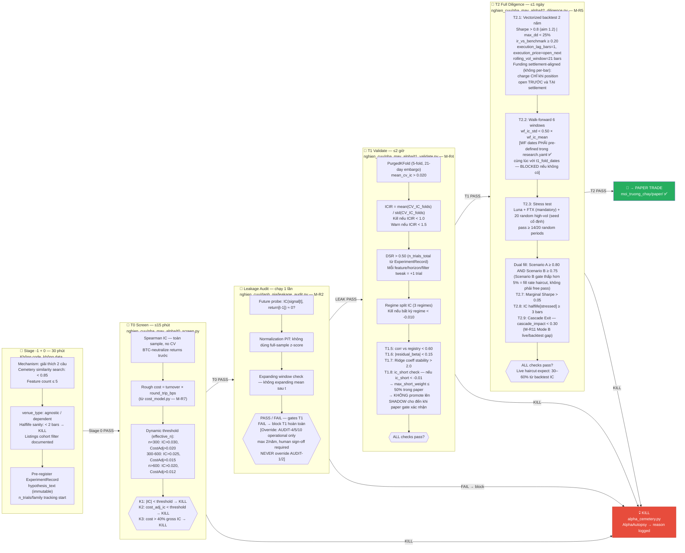

> **Throughput:**
> - Stage -1+0: ~10–20 ideas/week (15–30 phút/idea)
> - T0: ~5–10 PASS/week (automated, ≤15 phút)
> - T1: ~1–3 PASS/week (≤2 giờ + leakage gate)
> - T2: ~0.5–1 PASS/week (≤1 ngày)
> - Target kill rate: T0 kills 85–95% của ideas qua Stage 0

---

## C. Alpha Lifecycle — Kill Gates

```mermaid
flowchart TB
    IDEA["💡 IDEA\nTừ notebooks / anomaly_miner\nHypothesis seed"]

    STAGE_M1["STAGE -1 — 15 phút\nKhông code, không data"]
    GM1{{"Cemetery similarity < 0.85?\nFeature count ≤ 5?\nHalflife ≥ 2 bars?\nEconomic mechanism 2 câu?"}}

    STAGE0["STAGE 0 — 30 phút\nPre-registration"]
    G0{{"hypothesis_text locked?\nvenue_type declared?\nListing cohort filter documented?\nExperimentRecord created?"}}

    T0["T0 SCREEN — ≤15 phút\nt0_screen.py — M-R3\nIC + cost gate"]
    GT0{{"IC > threshold (dynamic, n-based)?\ncost_adj_ic > threshold?\ncost < 40% gross IC?"}}

    LEAK["LEAKAGE AUDIT — M-R2\nleakage_audit.py\nGate bắt buộc trước T1"]
    GL{{"Future probe ≈ 0?\nNormalization PiT?\nNo look-ahead?"}}

    T1["T1 VALIDATE — ≤2 giờ\nt1_validate.py — M-R4"]
    GT1{{"mean_cv_ic > 0.020?\nICIR > 1.0 (kill nếu < 1.0)?\nDSR > 0.50 (n_trials_total)?\nNo regime IC < -0.010?\ncorr_registry < 0.60?\n|residual_beta| < 0.15?\nRidge stability > 2.0?\nT1.8: ic_short check?"}}

    T2["T2 FULL DILIGENCE — ≤1 ngày\nt2_diligence.py — M-R5"]
    GT2{{"Sharpe > 0.8? max_dd < 25%?\nir_vs_benchmark ≥ 0.20?\nwf_ic stable? WF dates pre-defined?\nLuna 2022-05-07/14 + FTX 2022-11-07/14 + 20 random?\nDual fill A≥0.80 AND B≥0.75?\nT2.9: cascade_impact < 0.30?\nFunding settlement-aligned?"}}

    PAPER["📝 PAPER TRADE\nmoi_truong_chay/paper/ ✅\n≥ 60 trading days (M-R9 SHADOW gate)\nInterim check sau 30 ngày: IC ≥ 70% backtest\nfill_capture.py → calibrate M-R7\n[ic_short < -0.01 → max_short_weight ≤ 50%]"]
    GP{{"Live IC ≥ 70% backtest IC?\npaper_ic_absolute ≥ 0.025?\nRolling 10d IC ≥ 0.015 mọi window?\nSlippage ≤ 2× model estimate?\nExecution parity OK?\n[ic_short ổn định trong paper gate?]\n≥ 60 trading days đủ?"}}

    LIVE["🚀 LIVE TRADE\nReal capital (small)\nAll risk gates active\nScheduled T2 re-val: 6 tháng"]
    GL2{{"Rolling 30d IC ≥ 25% inception\nsustained ≥ 14 ngày?\nDD < 15%?"}}
    GCRISIS{{"HARD_DECAY +\nM-R11 crisis regime?\n(btc_alt_corr > 0.8\nOR vacuum)"}}

    SCALE["📈 SCALE UP\n+25% capital/month\nM-L4 ERC khi ≥2 alphas\nFamily exposure ≤ 60%"]

    HIBERNATE["😴 HIBERNATE\nScale to 0%\nGiữ trong registry\nReactivate check sau 21 ngày\nMax 90 ngày"]

    RETIRE["📉 RETIRE\nCapital taper 25%/week\nPost-mortem → cemetery\nalpha_retirement.py"]

    KILL["💀 KILL\nalpha_cemetery.py\nAlphaAutopsy(kill_reason)\nSimilarity index updated"]

    IDEA --> STAGE_M1 --> GM1
    GM1 -->|"PASS"| STAGE0
    GM1 -->|"FAIL"| KILL
    STAGE0 --> G0
    G0 -->|"PASS"| T0
    G0 -->|"FAIL"| KILL
    T0 --> GT0
    GT0 -->|"PASS"| LEAK
    GT0 -->|"KILL"| KILL
    LEAK --> GL
    GL -->|"PASS"| T1
    GL -->|"FAIL — block"| KILL
    T1 --> GT1
    GT1 -->|"ALL PASS"| T2
    GT1 -->|"ANY FAIL"| KILL
    T2 --> GT2
    GT2 -->|"ALL PASS"| PAPER
    GT2 -->|"ANY FAIL"| KILL
    PAPER --> GP
    GP -->|"PASS"| LIVE
    GP -->|"FAIL"| KILL
    LIVE --> GL2
    GL2 -->|"HEALTHY"| SCALE
    GL2 -->|"HARD_DECAY"| GCRISIS
    GCRISIS -->|"YES — crisis"| HIBERNATE
    GCRISIS -->|"NO — normal market"| RETIRE
    HIBERNATE -->|"IC recover 30 ngày"| LIVE
    HIBERNATE -->|"90 ngày không recover"| RETIRE
    RETIRE -->|"post-mortem filed"| KILL
    SCALE -->|"continuous monitoring"| LIVE

    style KILL fill:#e74c3c,stroke:#c0392b,color:#fff
    style RETIRE fill:#e67e22,stroke:#d35400,color:#fff
    style HIBERNATE fill:#5d4037,stroke:#4e342e,color:#fff
    style LIVE fill:#27ae60,stroke:#229954,color:#fff
    style SCALE fill:#2ecc71,stroke:#27ae60,color:#000
    style IDEA fill:#3498db,stroke:#2980b9,color:#fff
    style STAGE_M1 fill:#8e44ad,stroke:#7d3c98,color:#fff
```

---

## D. Live vs Research — Code Parity

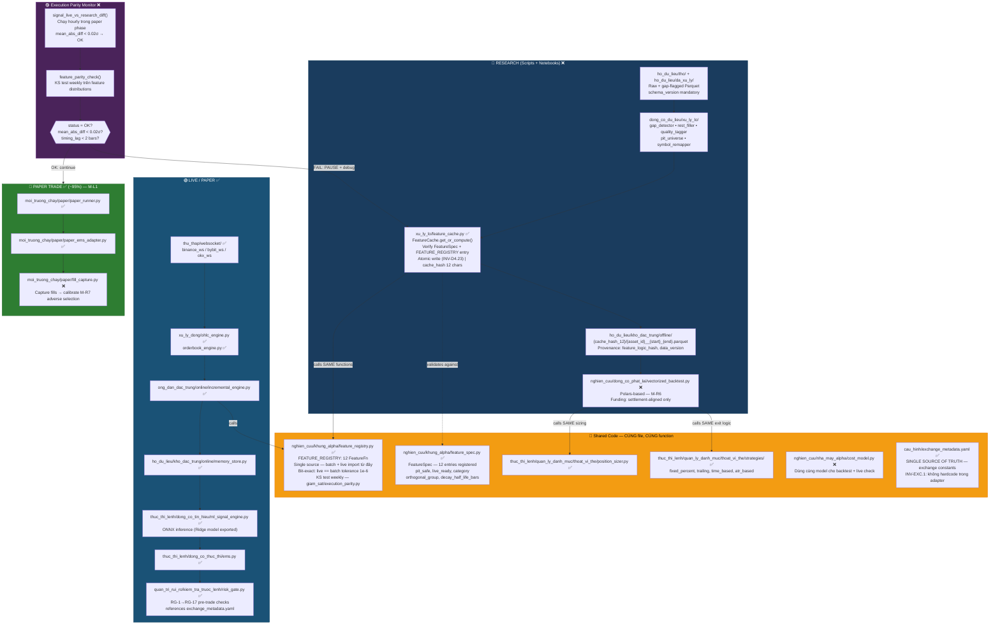

---

## E. Backtest Pipeline — Gate Logic

```mermaid
flowchart LR
    IDEAS["Alpha ideas\nqua Stage -1 + 0\nT0 PASS"]

    subgraph T0_GATE["⚡ T0 Screen — ≤15 phút\nnghien_cuu/nha_may_alpha/t0_screen.py"]
        direction TB
        T0G1["Spearman IC (toàn sample)\nBTC-neutralized returns"]
        T0G2["Dynamic threshold (effective_n)\n  n<300: IC>0.030\n  300-600: IC>0.025\n  n>600: IC>0.020"]
        T0G3{{"IC pass?\ncost_adj_ic pass?\ncost < 40% gross IC?"}}
        T0G1 --> T0G2 --> T0G3
    end

    subgraph LEAK_GATE["🔍 Leakage Audit — Gate bắt buộc\nnghien_cuu/danh_gia/leakage_audit.py"]
        direction TB
        LG1["future_probe: IC(signal[t], return[t-1]) ≈ 0"]
        LG2["normalization PiT: expanding window only"]
        LG3{{"PASS?\n(FAIL = hard block T1)\nOverride: AUDIT-4/5/10 operational, max 2/năm\nNEVER override AUDIT-1/2"}}
        LG1 --> LG2 --> LG3
    end

    subgraph T1_GATE["🎯 T1 Validate — ≤2 giờ\nnghien_cuu/nha_may_alpha/t1_validate.py"]
        direction TB
        T1G1["PurgedKFold 5-fold, embargo 21 days\nmean_cv_ic > 0.020"]
        T1G1b["ICIR = mean(CV_IC) / std(CV_IC)\nKill nếu ICIR < 1.0\nWarn nếu ICIR < 1.5"]
        T1G2["DSR > 0.50 (n_trials_total — cross-family)\n+1 per feature/horizon/filter tweak"]
        T1G3["Regime split IC — commit thresholds trước T0\nAll 3 regimes IC > -0.010"]
        T1G4["T1.5: corr_registry < 0.60\nT1.6: |residual_beta| < 0.15\nT1.7: Ridge stability > 2.0\nT1.8: ic_short < -0.01 → max_short_weight ≤ 50%\n  (không kill, nhưng constrain paper exposure)"]
        T1G5{{"ALL pass?"}}
        T1G1 --> T1G1b --> T1G2 --> T1G3 --> T1G4 --> T1G5
    end

    subgraph T2_GATE["📊 T2 Full Diligence — ≤1 ngày\nnghien_cuu/nha_may_alpha/t2_diligence.py"]
        direction TB
        T2G1["Vectorized backtest 2 năm (Polars)\nSharpe > 0.8 | aim 1.2 | max_dd < 25%\nir_vs_benchmark ≥ 0.20\nexecution_lag_bars=1 (open_next)\nrolling_vol_window=21\nFunding settlement-aligned (không per-bar):\n  charge chỉ tại bar settlement khi position open"]
        T2G2["Walk-forward 6 windows\nwf_ic_std < 0.50 × wf_ic_mean\n[BLOCKED nếu wf_test_dates không có\ntrong research.yaml ✅ trước T1]"]
        T2G3["Stress: Luna 2022-05 + FTX 2022-11\n+ 20 random high-vol (seed cố định) ≥ 14/20 pass\nNot negative BOTH mandatory periods"]
        T2G4["T2.7: marginal_sharpe > 0.05\nT2.8: IC halflife[stressed] ≥ 3 bars\nDual fill: Scenario A ≥ 0.80 AND Scenario B ≥ 0.75\n(Scenario B gate thấp hơn 5% = fill rate haircut, không phải free pass)\nT2.9: Cascade Exit — cascade_impact < 0.30"]
        T2G5{{"ALL pass?\nExpect 30–60% IC haircut live"}}
        T2G1 --> T2G2 --> T2G3 --> T2G4 --> T2G5
    end

    DEAD0["💀 KILL — IC/cost gate"]
    DEAD1["💀 KILL — leakage"]
    DEAD2["💀 KILL — T1 fail"]
    DEAD3["💀 KILL — T2 fail"]
    PAPER_GO["📝 Paper Trade ≥ 60 ngày\nfill_capture → calibrate adverse selection"]

    IDEAS --> T0_GATE
    T0G3 -->|"FAIL"| DEAD0
    T0G3 -->|"PASS"| LEAK_GATE
    LG3 -->|"FAIL"| DEAD1
    LG3 -->|"PASS"| T1_GATE
    T1G5 -->|"FAIL"| DEAD2
    T1G5 -->|"PASS"| T2_GATE
    T2G5 -->|"FAIL"| DEAD3
    T2G5 -->|"PASS"| PAPER_GO

    style DEAD0 fill:#e74c3c,color:#fff
    style DEAD1 fill:#e74c3c,color:#fff
    style DEAD2 fill:#e74c3c,color:#fff
    style DEAD3 fill:#e74c3c,color:#fff
    style PAPER_GO fill:#27ae60,color:#fff
    style LEAK_GATE fill:#e67e22,stroke:#d35400,color:#fff
```

---

## F. Feature Development Workflow

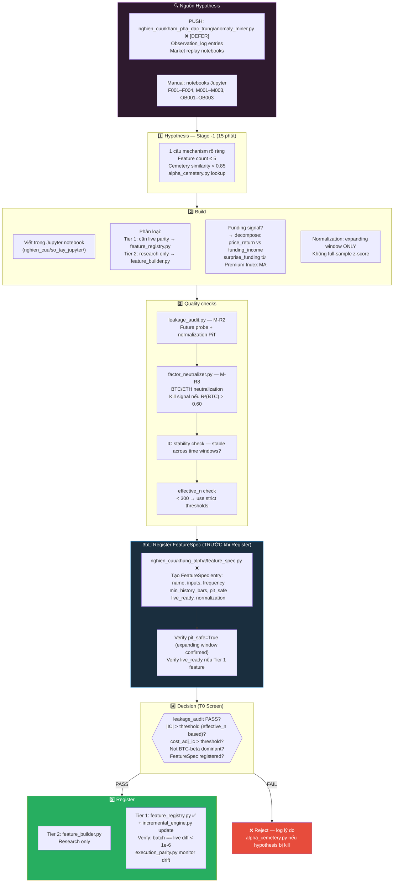

---

## G. Walk-Forward Retraining Workflow

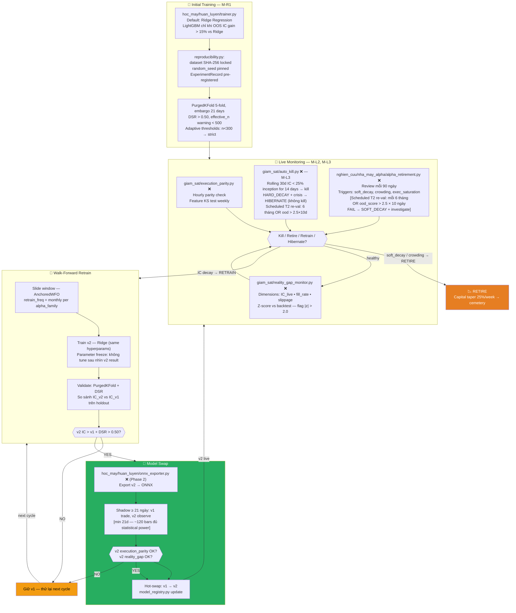

---

## H. Alpha Combination & Portfolio Construction

```mermaid
flowchart TB
    subgraph ALPHAS["🔬 Active Alphas — lifecycle = LIVE"]
        A1["Family 1: Funding Dislocation\nF001–F004 | IC 0.04–0.08\nPriority 1 — Phase 2"]
        A2["Family 2: OI-Weighted XS Momentum\nM001–M003 | IC 0.03–0.05\nPriority 2 — Phase 2"]
        A3["Family 3: OB Microstructure ❌\nOB001–OB003 | IC 0.04–0.09\nFull paper: Phase 3+ ONLY sau F1/F2 ≥100 fills\n[Capped paper 10% size OK nếu T2 PASS với 1.5× cost]"]
    end

    subgraph NEUTRAL["⚖️ Factor Neutralization — M-R8\nnghien_cuu/nha_may_alpha/factor_neutralizer.py ❌"]
        direction TB
        N1["BTC beta neutralization\nRolling OLS 21-day window\nKill nếu R²(BTC) > 0.60"]
        N2["ETH beta neutralization (sau BTC)"]
        N3["Cross-sectional sector demeaning\nper 4-hour bar"]
    end

    subgraph REGISTRY_CHECK["📋 Alpha Registry Check — M-R9\nalpha_registry.py ❌"]
        direction TB
        RC1["Correlation vs existing alphas\nReturn series corr < 0.60"]
        RC2["Marginal Sharpe > 0.05\n(với existing portfolio)"]
        RC3["Similarity search vs cemetery\nKhông reinvent killed ideas"]
    end

    subgraph ERC["📐 ERC Portfolio — M-L4 (Phase 3)\nhoc_may/to_hop_alpha/erc_optimizer.py ❌"]
        direction TB
        E1["Equal Risk Contribution\nMỗi alpha contribute equal volatility\nKhông MVO — không CVXPY"]
        E2["Constraints:\n  gross_leverage ≤ 2.0\n  net_leverage ≤ 0.5\n  |w_symbol| ≤ 0.20 per name\n  turnover ≤ 20%/ngày two-way\n  family_exposure[F] ≤ 60%\n  (block new LIVE promotions nếu > 60%)\n  Portfolio IC kill nếu tất cả live alphas\n  trong family có rolling_ic_30d < 0.010"]
        E3["portfolio_rebalancer.py\nDiff current vs target\nGenerate rebalance orders"]
        COMB["combination_engine.py (Phase 3)\nIC-weighted average (không simple avg):\n  weight_i = max(0, rolling_ic_21d_i) / sum(weights)\n  Down-weight alphas đang decay tự động\n  Fallback: equal weight nếu < 21d data"]
        E1 --> E2 --> E3
        COMB -.->|"combined signal"| E3
    end

    subgraph FUNDING["💸 Funding Decomposition — M-R7"]
        direction TB
        FD1["raw_return = price_return + funding_income"]
        FD2["Test IC trên price_return\nKhông tổng return (funding contaminate)"]
        FD3["surprise_funding = realized - expected\nExpected từ Premium Index MA"]
        FD4["⚠️ Funding settlement-aligned:\nCharge CHỈ tại settlement bars (00:00/08:00/16:00 UTC)\nChỉ khi position[t] != 0 AND position[t-1] != 0\nKhông per-bar approximation"]
        FD1 --> FD2 --> FD3 --> FD4
    end

    subgraph RISK_GATE["🔴 Risk Gate — M-L5\nquan_tri_rui_ro/kiem_tra_truoc_lenh/risk_gate.py ✅"]
        direction TB
        RG1["RG-1→RG-12: existing checks"]
        RG2["RG-13: Inventory Skew (HHI < 0.30)\nRG-14: Cancel/Replace Storm (>10/min → pause)\nRG-15: Dead-Man Switch (heartbeat 300s)"]
        RG3["RG-16: ADL Risk Monitor ❌\nAlert nếu ADL rank top-10%\nReduce 30% nếu top-5% → block new entries\nINV-EXC.1: references exchange_metadata.yaml"]
        RG4["RG-17: Exchange Solvency Monitor ❌\nFTX-pattern: withdrawal freeze, insurance fund\nMax 20% capital per exchange\nHalt + initiate withdrawal 50% khi flag"]
        RG1 --> RG2 --> RG3 --> RG4
    end

    subgraph ATTR["🔎 Signal Attribution (Phase 3)\nnghien_cuu/danh_gia/signal_attribution.py ❌"]
        direction TB
        SA1["Build khi có ≥50 paper fills\nWHY signal fired per bar:\n  signal_score = sum(coef_i × feature_i)\n  Attribution: funding_extreme=+0.42, OI_div=+0.31"]
        SA2["Dùng để debug decay, live drift,\nfalse positives"]
        SA1 --> SA2
    end

    ALPHAS --> NEUTRAL --> REGISTRY_CHECK --> ERC
    FUNDING -->|"price_return IC"| ALPHAS
    ERC --> RISK_GATE
    RISK_GATE -->|"PASS → execute"| EXEC["thuc_thi_lenh/dong_co_thuc_thi/ems.py ✅"]
    ERC -.->|"Phase 3"| ATTR

    style A3 fill:#4a1a1a,stroke:#e74c3c,color:#fff
    style ERC fill:#1a3c2e,stroke:#27ae60,color:#fff
    style EXEC fill:#27ae60,color:#fff
    style ATTR fill:#1a2e4a,stroke:#3498db,color:#fff
    style RG3 fill:#3a1a1a,stroke:#e74c3c,color:#fff
    style RG4 fill:#3a1a1a,stroke:#e74c3c,color:#fff
```

---

## I. Production Monitoring & Auto-Kill Loop

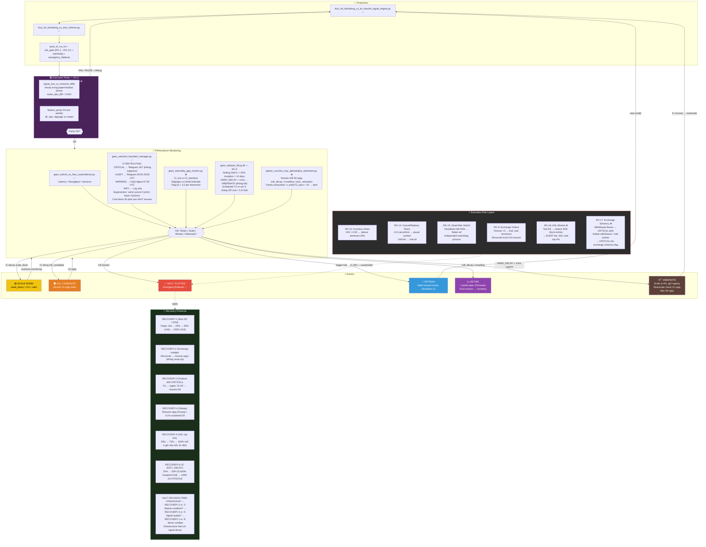

> **Dashboard Spec (4 screens — build trước ngày 1 paper trade):**
> - **Screen 1** (Health): Daily, ≤60 giây — PnL, leverage, alpha IC status, system OK
> - **Screen 2** (Alpha Detail): Khi có vấn đề — IC series, paper vs backtest IC, TCA breakdown
> - **Screen 3** (TCA): Weekly — actual vs model cost, maker fill rate, urgency distribution
> - **Screen 4** (Regime): Weekly — M-R11 state_vector, ood_score, btc_alt_corr, funding extremes

---

## J. Data Sourcing & Reconciliation Flow

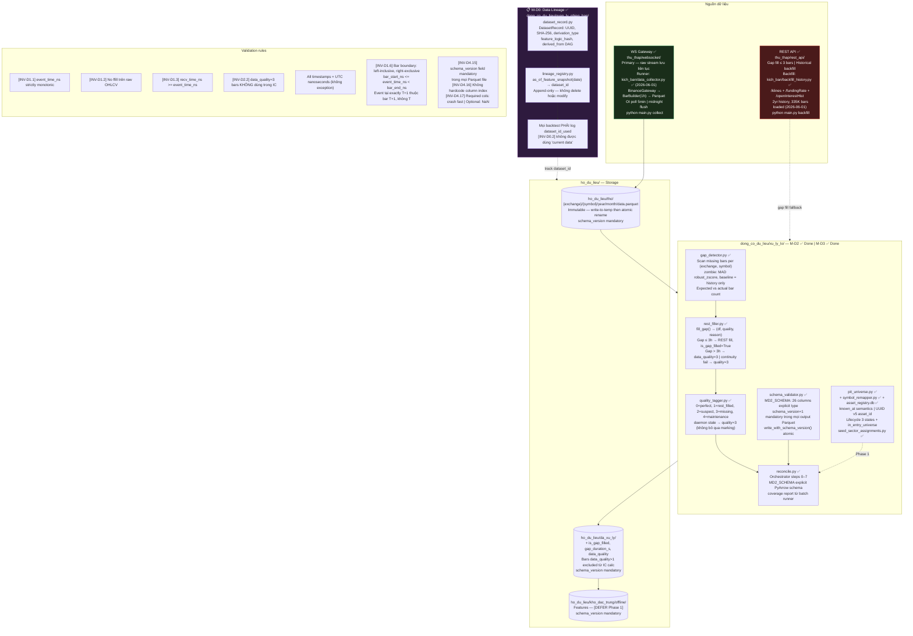

---

## K. Alpha Triage — Research Velocity

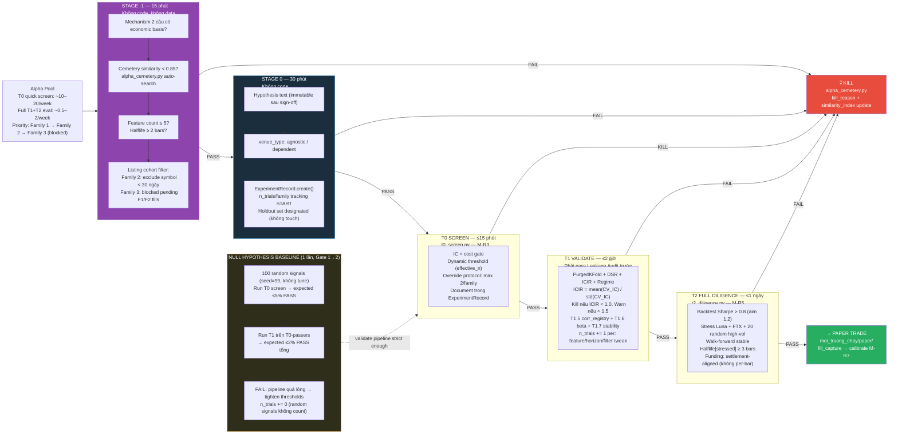

---

## L. Feature Discovery Engine

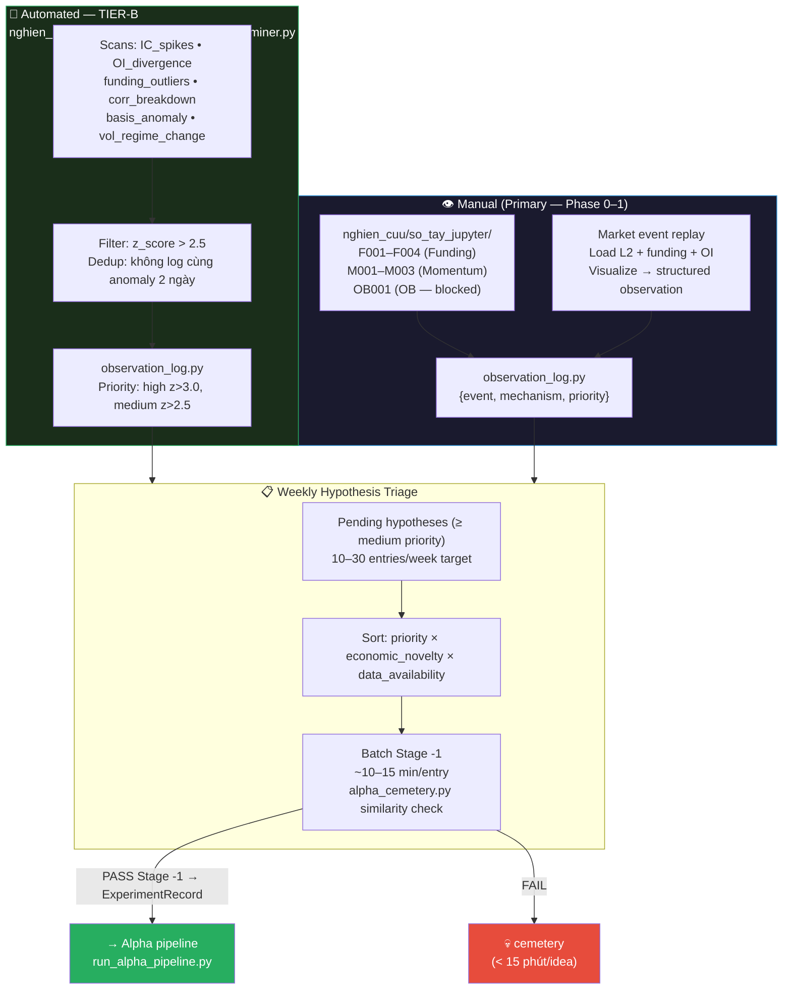

---

## M. Live Dashboard Spec

```mermaid
flowchart TB
    subgraph DASH["📊 Live Dashboard — Build TRƯỚC ngày 1 paper trade"]
        direction TB

        subgraph S1["SCREEN 1: HEALTH (daily, ≤60 giây)"]
            direction TB
            H1["Portfolio: PnL today/week | Gross/net leverage | Free collateral"]
            H2["Alpha Status: [F001 LIVE] IC_30d=X ✅|⚠️ | fills=N"]
            H3["System: Pipeline OK | Feature OK | WAL size | Open orders"]
            H4["Alerts: N CRITICAL, M WARNING | [see digest]"]
            H1 --> H2 --> H3 --> H4
        end

        subgraph S2["SCREEN 2: ALPHA DETAIL (khi có vấn đề)"]
            direction TB
            AD1["IC series last 30d (spark-line)"]
            AD2["IC vs inception: current/inception % — target ≥70%"]
            AD3["Paper vs backtest IC ratio — target ≥70%"]
            AD4["Fill rate maker actual vs target (≥0.55 BTC/ETH gate)"]
            AD5["TCA: timing_cost | impact_cost | fee split"]
            AD1 --> AD2 --> AD3 --> AD4 --> AD5
        end

        subgraph S3["SCREEN 3: TCA (weekly)"]
            direction TB
            T1["round_trip_cost actual vs model"]
            T2["adverse_selection actual vs model\n(update research.yaml khi gap > 30%)"]
            T3["maker_fill_rate by symbol, by hour-of-day"]
            T4["cancel_rate by symbol (alert if > 15%)"]
            T1 --> T2 --> T3 --> T4
        end

        subgraph S4["SCREEN 4: REGIME (weekly)"]
            direction TB
            R1["M-R11 state_vector last 7d:\n  regime: trending/ranging/stressed"]
            R2["ood_score max this week\n  (alert if > 2.5 on 3+ days)"]
            R3["btc_alt_corr rolling 7d\n  (alert if > 0.80 — crisis mode)"]
            R4["funding_extreme: any day funding_zscore > 2.5?"]
            R1 --> R2 --> R3 --> R4
        end

        BUILD_ORDER["Implementation priority:\nWeek 1 paper: Screen 1 + Alerts\nWeek 2: Screen 2 (Alpha Detail)\nWeek 4+: Screen 3 (TCA, sau ≥50 fills)\nMonth 2+: Screen 4 (Regime, sau M-R11 running)"]
    end

    subgraph ALERT_TIER["🔔 Alert Routing (4-tier)"]
        direction TB
        CR["CRITICAL → Telegram 24/7 (không suppress)\n  RG-1→RG-17 halt conditions\n  Dead-man switch fire (RG-15)\n  Exchange withdrawal freeze (RG-17)\n  Pipeline crash (live==0 khi research!=0)\n  Response: human trong 15 phút"]
        AL["ALERT → Telegram (00:00–20:00 UTC)\n  effective_leverage > 1.8\n  feature drift pct_diff > 10%\n  ADL rank top-5% (RG-16)\n  IC SOFT_DECAY triggered\n  Response: human review trong 2 giờ"]
        WA["WARNING → Daily digest 07:00 UTC\n  feature drift 1–10%\n  clock drift > 500ms\n  cancel rate > 15% (sub-threshold)\n  ICIR warn (< 1.5 trong paper)\n  symbol coverage < 95%"]
        IN["INFO → Log only (không Telegram)\n  normal fills, daily IC report\n  regime state update, backtest done"]
        SUPP["Suppression rules:\n  Same-source 5 phút: suppress duplicate\n  Flood >5 ALERT/10 min: aggregate\n  Cool-down 30 phút sau HALT resume\n  CRITICAL: không bao giờ suppressed"]
        CR --- AL --- WA --- IN --- SUPP
    end

    S1 --> S2 --> S3 --> S4
    ALERT_TIER -.->|"feeds alerts"| S1

    style CR fill:#c0392b,stroke:#e74c3c,color:#fff
    style AL fill:#d35400,stroke:#e67e22,color:#fff
    style WA fill:#b7950b,stroke:#f39c12,color:#000
    style IN fill:#1a3c1a,stroke:#27ae60,color:#fff
    style SUPP fill:#1a1a2e,stroke:#3498db,color:#fff
```
