# KAIROS v3 — Sơ đồ luồng dữ liệu & Workflow

> **Ký hiệu:** ✅ = đã có trong codebase | ❌ = cần build | 🔗 = tái dùng module có sẵn

---

## A. Master Data Flow — Toàn cảnh

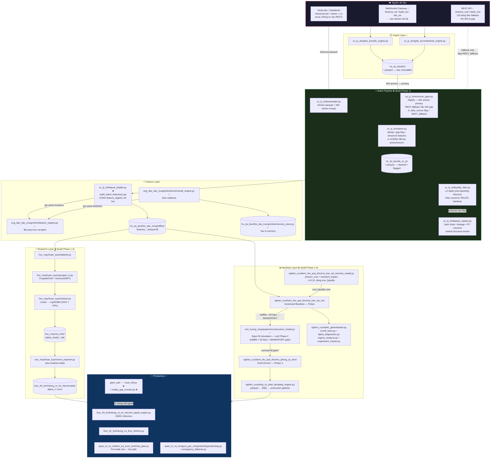

---

## B. Research Loop hàng ngày — Jupyter Notebooks

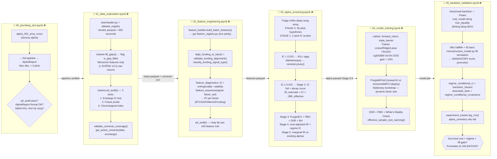

---

## C. Alpha Lifecycle — Kill Gates

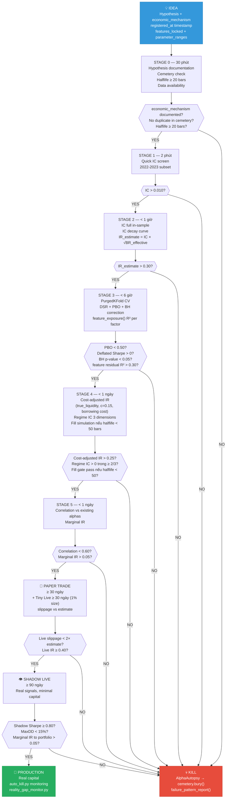

---

## D. Live vs Research — Code Parity

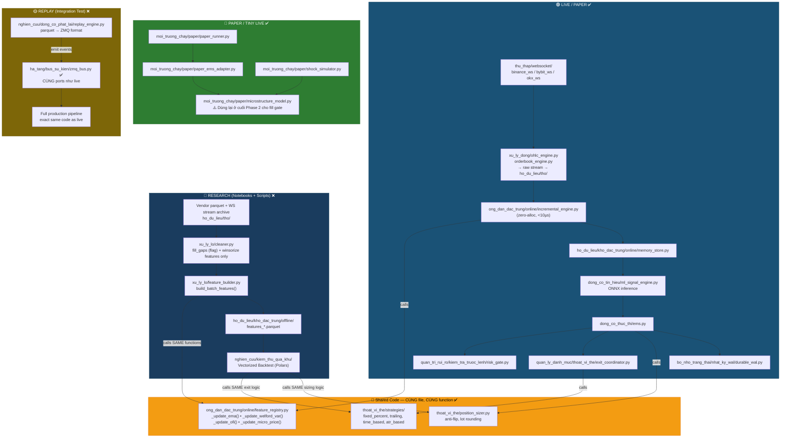

---

## E. Backtest Pipeline — Gate Logic

```mermaid
flowchart LR
    ALL["Alpha ideas\nqua Stage 0-2 triage"]

    subgraph TIER1["⚡ Vectorized Backtest\nnghien_cuu/kiem_thu_qua_khu/ma_tran_sie_toc/\n(vài giây / 4 năm data)"]
        direction TB
        V1["Polars batch signal compute\n(feature_registry.py — same as live)"]
        V2["cost_model.py: phase1_cost\n+ transient_impact\nc=0.15, true_liquidity không phải ADV"]
        V3["Exit logic từ thoat_vi_the/strategies/ ✅"]
        V4["evaluator.py: IC • IR • DSR • PBO\nalpha_diagnostics: decay • capacity\nregime_conditional_ic • effective_breadth"]
        V1 --> V2 --> V3 --> V4
    end

    GATE1{{"IC > 0.015?\nPBO < 0.50?\nDSR > 0?\nBH corrected p < 0.05?"}}

    subgraph FILL_GATE["⚠️ Fill Gate — MANDATORY\ncuối Phase 2 cho halflife < 50 bars"]
        direction TB
        FG1["moi_truong_chay/paper/microstructure_model.py ✅\nL2 snapshot fill simulation\nKhông dùng công thức mượt"]
        FG2{{"Slippage_actual ≤ 2× phase1_cost estimate?\nIR sau fill cost > 0?"}}
        FG1 --> FG2
    end

    subgraph TIER2["🎯 Event-Driven Backtest — Phase 4\nnghien_cuu/kiem_thu_qua_khu/mo_phong_su_kien/"]
        direction TB
        E1["event_backtest.py: tick-by-tick"]
        E2["fill_model.py: queue priority\npartial fills • latency injection"]
        E3["phase4_book_depletion_cost()"]
        E4["portfolio_optimizer.py + margin_ratio constraint\nround_to_lot() sau CVXPY"]
        E1 --> E2 --> E3 --> E4
    end

    GATE2{{"Sharpe_event > 0.7 × Sharpe_vectorized?\nMargin constraint satisfied?"}}

    subgraph TIER3["🔄 Replay — Phase 4\nnghien_cuu/dong_co_phat_lai/"]
        direction TB
        R1["replay_engine.py: parquet → ZMQ"]
        R2["Full production pipeline ✅"]
        R3["reality_gap_monitor.py tracking"]
        R1 --> R2 --> R3
    end

    ALL -->|"triage pass"| TIER1
    TIER1 --> GATE1
    GATE1 -->|"halflife < 50 bars\nhoặc cross-exchange"| FILL_GATE
    GATE1 -->|"halflife ≥ 50 bars\n→ VALIDATION trực tiếp"| VALIDATION["VALIDATION lifecycle"]
    FG2 -->|"pass"| VALIDATION
    FG2 -->|"fail"| DEAD1["💀 KILL\n(execution killed edge)"]
    GATE1 -->|"fail"| DEAD0["💀 KILL"]
    VALIDATION -->|"Phase 4"| TIER2
    TIER2 --> GATE2
    GATE2 -->|"pass"| TIER3
    GATE2 -->|"fail"| DEAD2["💀 KILL"]
    TIER3 -->|"Paper 30 ngày\n+ Tiny Live 30 ngày"| PAPER["📝 Paper/Tiny Live"]

    style DEAD0 fill:#e74c3c,color:#fff
    style DEAD1 fill:#e74c3c,color:#fff
    style DEAD2 fill:#e74c3c,color:#fff
    style PAPER fill:#27ae60,color:#fff
    style FILL_GATE fill:#e67e22,stroke:#d35400,color:#fff
```

---

## F. Feature Development Workflow

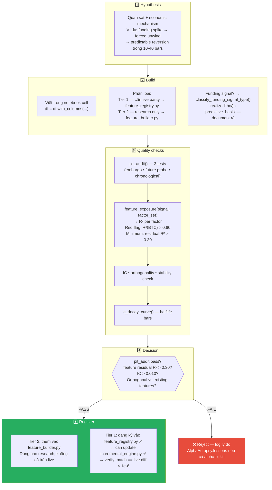

---

## G. Walk-Forward Retraining Workflow

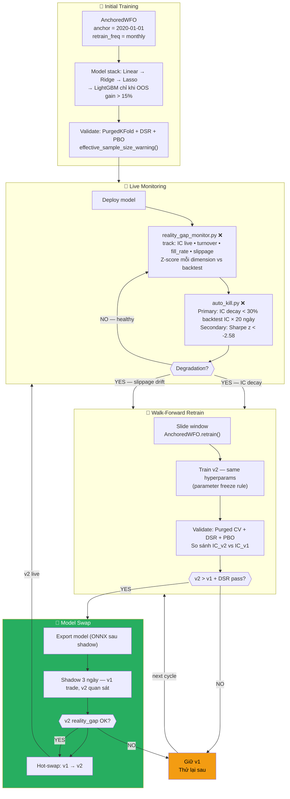

---

## H. Alpha Combination & Portfolio Construction

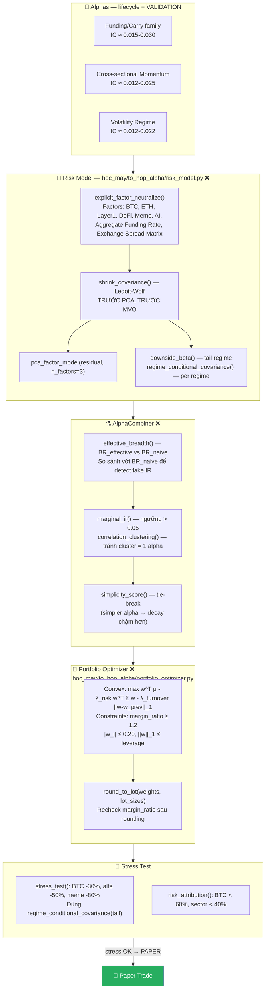

---

## I. Production Monitoring & Auto-Kill Loop

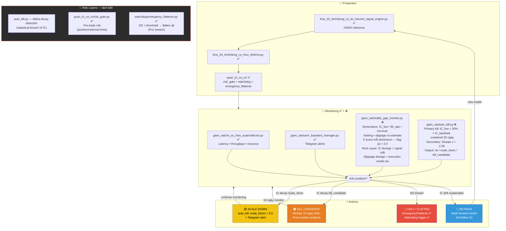

---

## J. Data Sourcing & Reconciliation Flow

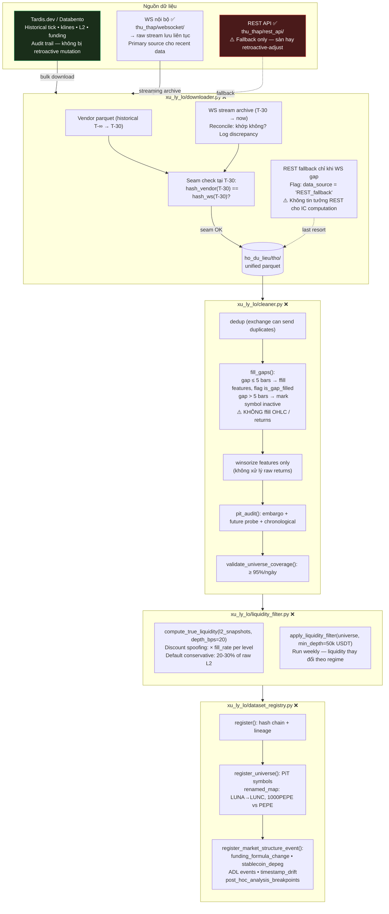

---

## K. Alpha Triage — Research Velocity

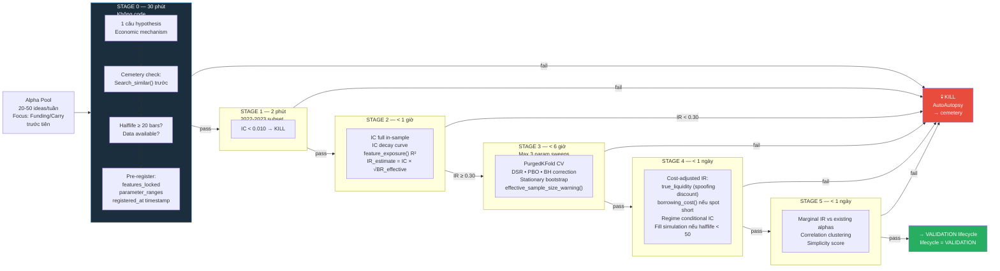